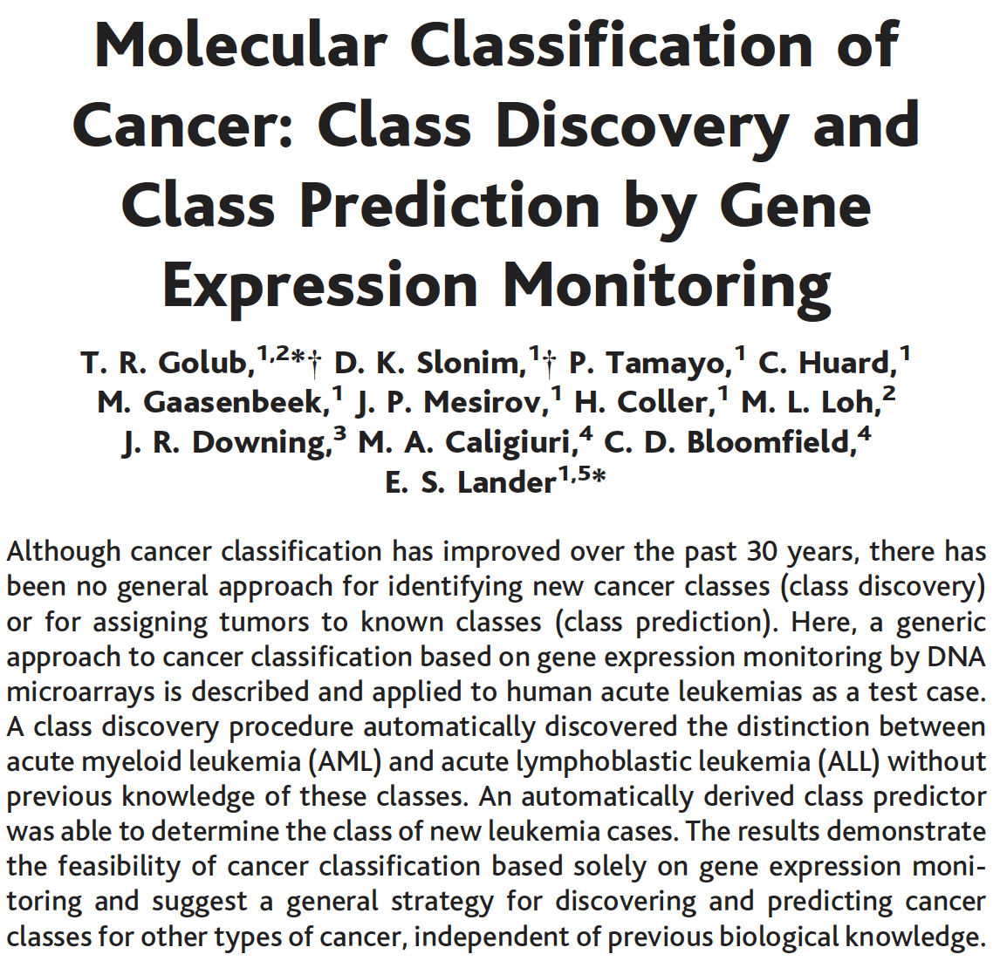
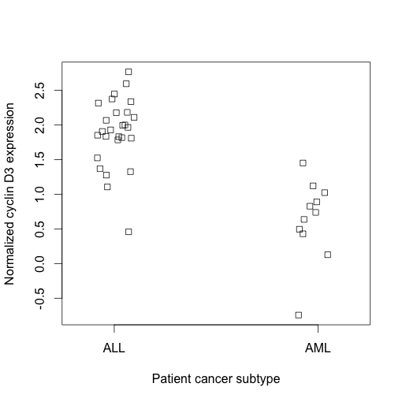
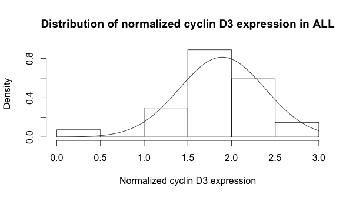
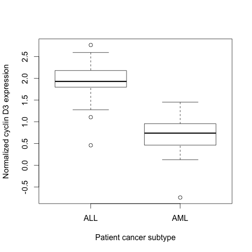
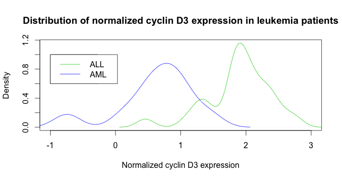

<span style="color:red"> In all lab assignments submitted for this course, you will ultimately be submitting a knitted HTML file (**saved as Lab#LastnameFirstname.html**) that performs the desired calculations and addresses the given tasks. Please write all answers in the provided "Lab 2 Answer Sheet" RMD file. It is best practice to provide comments in your code chunks that explain what your code does, especially for convoluted code chunks or for complex functions. If a comment is long, add a line break and # out a new line to improve readability. Be sure to periodically save the RMD file as you work on the tasks to avoid losing your work. Turn in your **knitted HTML** to your TA via the `Lab 2` assignment on Canvas by 11:59 pm CST the day **after** your lab. There will be a 20% penalty for each day the assignment is late, and no lab will be accepted after 3 days.</span>

<span style="color:purple">
**Lab goals:** <br>
**1. Learn how to create and index data frames and matrices. They provide easy ways to store and manage tabular data.** <br>
**2. Analyze gene expression data using basic functions in R. Specifically, we will analyze gene expression data for two different types of leukemia.** <br>
**3. Create graphs and charts to present data in an easily interpretable form. R is an excellent tool for creating visuals.**
\span

In this lab, you will learn how to make sophisticated graphics and perform preliminary data analysis in R in the context of a historically important set of gene expression data. R is a fantastic language for data-related graphics. To get a feel for some of the things R can do, cycle through the following demo by typing the following in the console (you can ignore the code that appears in the console):  

*demo("graphics")*

To remove all of the variables that were loaded into your workspace and reset a parameter that was specified in the demo, execute the following two lines in the console:

```{r}
rm(list=ls())	
par(ask=FALSE)
```

For this module, we will use a dataset from a paper from Golub (a UChicago Pritzker alum!) et al. Science 1999, 286(5439):531-537. This classic paper describes the first use of microarray gene expression data to classify cancer cell subtypes that are difficult to distinguish morphologically--using acute leukemia as a proof of principle.  

Leukemia ordinarily affects two types of bone marrow cells--those destined to become certain types of lymphocyte white blood cells (acute lymphoblastic leukemia, or ALL), and myeloid cells destined to become red blood cells, platelets, and other types of cells (acute myelogenous leukemia, or AML). Prior to this paper, tests had been established to distinguish ALL and AML in a diagnosis, but no single test could effectively discriminate subtypes, the analysis required specialized expertise, and error rates were high. The authors of this study obtained gene expression data from bone marrow samples of 38 patients suffering from leukemia of an established subtype. 
**<span style="color:blue">Gene expression refers to the level at which a given gene produces its gene products (the mRNA and proteins).** From the gene expression data, the authors defined a set of 50 genes whose differential expression correlated most significantly with ALL versus AML status. The authors applied this 50-gene set as a predictive tool to distinguish ALL and AML in an independent set of 34 leukemia patients, in which they achieved 100% accuracy in subtype determination.

Before we begin making **graphics** of our own, let's learn one way to **import** a data set using external packages, and acquaint ourselves with the data. Many of the exercises in this module are modeled off of exercises from Wim P. Krijnen's "Applied Statistics for Bioinformatics using R", and adapted from "Bioinformatics Algorithms An Active Learning Approach", written by Phillip Compeau & Pavel Pevzner.

## Part 1: Data frames
Matrices and data frames are the two primary ways to store tabular data as objects in R. Both matrices and data frames can store data in a tabular manner similar to a spreadsheet, **but in a matrix, all elements must be of the same data type** (e.g., all elements are numeric, character, etc.), while a data frame can have different data types in different columns. Matrices are more memory efficient in storing data, and are required for many operations based in linear algebra. Data frames are more flexible and thus more convenient for many data handling activities. Data frames can also extend beyond two dimensions. We will take a closer look at data frames now, and we'll encounter matrices later in the lab.  

One common way to create a data frame is through the `read.table()` function, which can take a table of tab-delimited or comma-separated values, such as a spreadsheet exported from Microsoft Excel, and create a new data frame object with the same tabular structure.

An alternative is to create vectors for each column, and then combine them into a table with the `data.frame()` function. The following contains information on several yeast proteins, taken from pax-db. See this demonstration of how to make a table using this information:  

```{r}
id <- c("ENO2", "TDH3", "RPL39", "GAL4", "POL12", "EST2") #protein codes
protName <- c("enolase", "glyceraldehyde-3-phosphate dehydrogenase", "60S ribosomal protein L39", "regulatory protein Gal4", "DNA polymerase subunit alpha B", "telomerase reverse transcriptase") #full protein names
abundance <- c(24563, 22369, 16232, 32.3, 13.7, 0.01) #cellular abundance in ppm
length <- c(437, 332, 51, 881, 705, 884) #number of amino acids
yeastProt <- data.frame(id, protName, abundance, length)
```

Similar to indexing values from a vector, we can pull particular values from a data frame using `[]` notation. 

<span style="color:green"> 1.1 <br>
a.) Run the following lines of code and describe what each line of code does. \span
```{r eval = FALSE}
yeastProt[,1]
yeastProt[3,1]  
yeastProt[1:6,3]  
yeastProt[,c(1,4)] 
```


<span style="color:green"> 
b.) Give a brief overview comparing indexing data frames and indexing vectors. \span

One convenient aspect of data frame is that you can name rows and columns for easier referencing. You can name your row or column using `rownames(df) <- your_rowname` or `colnames(df) <- your_colname`. You may also remove the names of the columns and rows by calling `unname(object)`. 

When working in data frames, there are two ways of **referencing particular columns by name** (use the `names()` function if you want a list of the column names of a data frame):

```{r}
yeastProt$abundance[1:3]

yeastProt[1:3, "abundance"]

```

Besides `$`, you may encounter cases where `@` is used for referencing when the object is an S4 object (But this is beyond the scope of this course!). 

When calling columns from a data frame inside some functions, you directly reference them using their names. For example, `plot(A,B,data = df)`, where `A` and `B` are two columns and `df` is the name of the data frame.

Data frame slicing is useful for creating subsets of data that fit a particular criterion indicated by a logical operator. 

<span style="color:green"> 1.2 Explain what happens in the following command. Hint: run `yeastProt[,4] > 300` and observe the result. \span

```{r eval = FALSE}
yeastProt[yeastProt[,4] > 300, 2]
```

<span style="color:green"> 1.3 Rewrite the above command (`yeastProt[yeastProt[,4] > 300, 2]`) with the two different data frame indexing notations above such that it would generate the same output. **Do not hard code indices.** \span


<span style="color:green"> 1.4 Construct a command that generates a *new data frame* that consists of information from proteins with a length strictly larger than 100. \span


## Part 2: Matrices
Matrices are very similar to vectors in that they contain many values. However, there are many situations in which a vector is not sufficient to hold all of our data of interest. Matrices come in handy because they are 2 dimensional, not 1 dimensional like vectors.

Matrices can be created in the following way:

```{r comment = ''}
matrix(nrow = 2, ncol = 2, data = 1:4)
```

As you may have guessed, the `nrow` and `ncol` arguments dictate how many rows and columns there are in the matrix. The data argument takes a vector, and subsequently populates the elements of the matrix with the values in the vector. In R's matrix command there is a default argument `byrow`, which by default is set to `FALSE`. However, this can be overridden by the following:

```{r comment = ''}
matrix(nrow = 2, ncol = 2, data = 1:4, byrow =TRUE)
```


<span style="color:green">
2.1 Do you see a difference in the two matrices? What do you think the `byrow` argument is doing?</span>

Above we specified a vector that was conveniently the same size as the number of elements in our matrix.

Like vectors, matrices can be used with a lot of R's built-in functions. Create the following matrix.

```{r comment = ''}
x <- matrix(nrow = 5, ncol = 5, data = 1:25)
x
```

If we use the built-in R function `rowMeans()`, we can obtain the mean of each row of data in our matrix (returned as a vector).

```{r comment = ''}
rowMeans(x)
```

Similarly, the built-in function `colMeans()` will get us the means of each of the columns:

```{r comment = ''}
colMeans(x)
```

<span style="color:green">
2.2 Try using some of the built-in functions on this matrix (i.e. `mean()`, `sd()`, `sum()`, etc.). How is R performing these calculations (is it by row, by column, or all elements in the matrix?)</span>


We can also access individual elements of our matrix. For the following exercises, create the following matrix:

```{r comment = ''}
testMatrix <- matrix(nrow = 3, ncol = 3, data = 1:9)
testMatrix
```

Like with vectors, we access the elements of a matrix using brackets. However, this time we have to provide two values to the brackets instead of just one. But which value represents the rows and which represents the columns? For you hipsters out there, just think of RC Cola, or more specifically just the RC part. **The index for the row comes first and then the index for the column.** Say we wanted to find the value in the third row and the second column; the syntax would be the following:

```{r comment = ''}
testMatrix[3, 2]
```

If we wanted to get the element in the second row at the third column:

```{r comment = ''}
testMatrix[2, 3]
```

<span style="color:green">
2.3 Create a 4 x 4 matrix with whatever starting values you please. Use indexing to replace each element in the first row of the matrix with a new value.</span>

If we want all values in the second row returned as a vector, then we simply leave the column value blank:

```{r comment = ''}
testMatrix[2,]
```

Or if we wanted all values in the second column:

```{r comment = ''}
testMatrix[, 2]
```

Just like with vectors, if two matrices have the same dimensions (and contain numeric data) we can perform arithmetic operations on them.

```{r comment = ''}
testMatrix + testMatrix
testMatrix * testMatrix
```

**Note that the above matrix multiplication is not true matrix multiplication.** If you are not familiar with matrix multiplication, take a look at this tutorial (<https://www.mathsisfun.com/algebra/matrix-multiplying.html>) or ask one of the TAs for help

Like we did for vectors, we could use `length()` to determine the number of elements in the matrix. However, this doesn't help us if we want to know the number of rows or the number of columns. Thankfully, there are built-in functions to help us with that also.

```{r comment = ''}
ncol(x)
nrow(x)
```

If we want to know the overall dimensions of the matrix, we can use the built-in function dim(), which will return a vector.

```{r comment = ''}
dim(x)
```

<span style="color:green">
2.4 Make a matrix of your own that contains a different number of rows and columns. Which element of the vector returned by `dim()` represents the number of rows? Which represents the number of columns?</span>


## Part 3: Getting familiar with the Golub data

We are going to interact with a subset of the original Golub et al. training data set, which contains normalized gene expression values for 3051 genes from blood cancer patients. Specifically, this set contains data from 27 acute lymphoblastic leukemia patients (ALL) and 11 acute myeloid leukemia patients (AML), which was derived from microarray analysis. The Golub data set comes from a 1999 study that showed how new cases of cancer could be classified by gene expression monitoring and proved this new concept of identifying cancer classes by epigenetics (the paper is available in the lab folder). 



<br>

<span style="color:green"> 3.1 Describe, in your own words, how Golub et. al study the levels of gene expression (Hint: check figure 1 of the paper) \span

This data is included as part of the **external package** "multtest." There are thousands of packages written by R users across the globe, which contain novel functionalities not present in the R base package. <span style="color:violet"> One large repository of external packages for bioinformatics is Bioconductor \span (http://en.wikipedia.org/wiki/Bioconductor). We are going to use R to download Bioconductor, load the multtest library, and access the Golub data. Run the following four commands in the command prompt.

```{r eval = FALSE}
if (!requireNamespace("BiocManager", quietly = TRUE))
    install.packages("BiocManager")
BiocManager::install("multtest") #uses Bioconductor's installation tool to install the multtest package
library(multtest) #loads a library of tools included in the multtest package, including the Golub data
data(golub) #loads the Golub dataset
```

```{r echo = FALSE, message = FALSE}
#Silently runs the last two commands from above (to load the multtest library and the golub dataset)
#in the R Markdown document's R environment; necessary for later code execution.
library(multtest)
data(golub)
```

You should now have three new objects loaded in your environment: *golub*, *golub.gnames*, and *golub.cl*. The matrix golub contains normalized microarray gene expression data for 3051 genes from the 38 leukemia patients (check with `dim(golub)`), with each row representing a gene and each column an individual. You can use the command `head(golub)` to take a quick look at how the data is formatted, without printing the entire matrix to your console. The matrix golub.gnames contains the same 3051 rows in an equivalent order to golub, providing gene names for each row. The numeric vector *golub.cl* contains 38 numbers in the same column order as golub, providing leukemia subtype identifiers for each patient; **0 codes for ALL and 1 codes for AML**.

<span style="color:green"> 3.2 Using the information encoded in golub.cl, which columns in the golub matrix represent patients with ALL and which columns represent patients with AML? \span

<span style="color:green"> 3.3 The gene names are stored in `golub.gnames`. Why must the gene names be placed in a separate matrix from the gene expression data? \span

What if we wanted to compare the average gene expression values between ALL and AML patients? To explore this, let's use one of the genes of interest from the Golub et al. study. One gene whose expression difference correlates strongly with ALL versus AML status is called cyclin D3. In order to find which row of the golub matrix represents expression values for this protein, we will have to find the right row in the golub.gnames matrix. If we knew the exact gene name, we could construct a logical expression slicing command that returns the row number with our gene of interest. Let's say, however, that we know we are looking for cyclin D3 but we don't know the exact syntax with which that gene is labeled. To find the correct row for cyclin D3, we will use the `grep()` search command which takes two primary commands: a character string query and a vector that you want to search.

<span style="color:green"> 3.4 Use `?grep` to figure out how to write a query and use it to find the row that contains the data for cyclin D3. Hints: remember, a character string must be surrounded by quotation marks; which column of golub.gnames do you want to search? Turn on the `ignore.case` argument. \span

Now that we know the row containing data on cyclin D3, we are ready to slice this row in the golub matrix to figure out the mean expression of ALL and AML patients. Look at golub.cl to determine which columns represent ALL versus AML patients based on the 0 / 1 coding. In the next several prompts, I will use xxxx to represent the row name that you have determined contains cyclin D3 from question 3.2, 1:xx to represent the columns containing ALL patient data, and yy:38 to represent the columns containing AML patient data.

<span style="color:green"> 3.5 Utilizing the techniques you've learned, calculate the mean expression of cyclin D3 mRNA in ALL patients and then in AML patients (you should have two answers). \span

In order to determine the statistical significance of this differentially expressed gene, we could conduct a simple t-test in R. This calculation reports the probability of the null hypothesis that the two sets of data are indistinguishable from one another, represented by the p-value. **Generally if the p-value is less than 0.05, we can reject the null hypothesis and conclude that the different values for the two groups did not just occur due to chance.** For more information about the test please [check](https://en.wikipedia.org/wiki/Student%27s_t-test)

<span style="color:green"> 3.6 Run the t-test on cyclin D3 expression values, report the p-value, and interpret its meaning (replace the xx with the values you found above).

```{r eval = FALSE}
t.test(golub[xxxx,1:xx],golub[xxxx,yy:38])
```

It would be useful to rapidly determine which genes in the data set have the largest difference in mean expression between ALL and AML patients, as these genes are likely to be useful in distinguishing cancer cell subtypes. If we wanted to compute the difference in mean expression of each gene for ALL and AML patients, we could do so with a for loop as discussed in the previous lab: 

```{r eval = FALSE}
absMeanDiff <- vector()  
for (i in 1:nrow(golub)) {
    meanALL <- mean(golub[i , 1:xx])
    meanAML <- mean(golub[i , yy:38])
    absMeanDiff[i] <- abs(meanALL - meanAML)
}
```

If you were to perform this operation on a much larger matrix, you would find that the computation is frustratingly slow. While there is nothing wrong with this formulation, it is not the most computationally efficient. R has a set of built in looping functions that loop through columns or rows of a data table and repeat a specific function, much in the same way as the for loop above. These functions are within the **apply** family of functions. The usage of `apply()` is illustrated and explained in the following line of code that computes the mean expression of each gene for ALL patients when run:

```{r eval = FALSE}
meanALL2 <- apply(golub[,1:xx], 1, mean)
```

In this command, we are assigning the iterative values of the apply loop to a new vector, meanALL2. In this apply loop, we are cycling through a subset of the golub matrix that corresponds to ALL patients. The second argument, the 1, tells the apply loop which dimension of the table to loop through. In a two-dimensional table with rows and columns, 1 tells apply to loop through the rows of a table, while a 2 would tell apply to loop through columns. Finally, the third argument, mean, tells apply which function should be iterated through each cycle of the loop. So this function will compute the mean of each **row** in from columns 1:xx and store the results in the meanALL2 vector.

<span style="color:green"> 3.7 <br>
a) Write a second apply command to compute the mean expression of each gene for AML patients. <br>

<span style="color:green"> b) Compute the absolute value of the difference in means between AML and ALL patients, and store the results in a new vector. \span

The last useful command for identifying differentially expressed genes is `order()`. To explore what `order()` does, observe the following sequence of commands.
```{r}
myVec <- c(105, 150, 102, 113, 98)
o <- order(myVec, decreasing=TRUE)
o
```

```{r}
myVec_sorted <- myVec[o]
myVec_sorted
```

<span style="color:green"> 3.8 Given your understanding of the order command, construct a series of commands that will return the names of the 8 genes that have the largest absolute difference in mean expression between ALL and AML patients. \span

<span style="color:green"> 3.9 (a) Compare the top 8 differentially expressed genes to those that were used as the predictive set in Figure 3 of the Golub et al. paper which of these genes is not used in the set of predictors? \span

<span style="color:green"> 3.9 (b) Why might a ranking based solely on differences in mean expression be an inadequate metric for determining the best predictors of cancer subtype? \span

<span style="color:green"> 3.9 (c) What might be a better statistical metric for identifying genes to become part of the predictive set? (If you are stuck, feel free to browse the Golub et al. paper to see what they actually did, though this is not necessarily the only correct answer.)  \span

Finally, let's construct **factors** for the golub.cl categorization. Creating factors for a numerically encoded assignment vector essentially serves to tell R what we already know: that 0 codes for ALL patients and 1 codes for AML patients. By telling this to R, we will be able to efficiently make comparative graphs that illustrate gene expression differences between cancer subtypes. 

<span style="color:green"> 3.10 Execute the following command and explain what it is doing. Please be sure to explain what each of the arguments in the code do. \span
```{r}
gol.fac <- factor(golub.cl, levels=c(0,1), labels = c("ALL","AML"))
```


The utility of this encoding will become apparent later on. But for now, we can see that we no longer need to remember the columns that correspond to ALL and AML patients. For example, for the t.test command used earlier, we can re-write it using our factors to partition columns by cancer subtype:

```{r eval = FALSE}
t.test(golub[xxxx,gol.fac=="ALL"],golub[xxxx,gol.fac=="AML"])$p.value
```

## Part 4: Making graphics in R

We will now introduce to you some of the basic graphics functions in R. To start, we will plot expression values from cyclin D3, whose gene expression values are in row 1042 (as determined in Part 2). One of the most basic plotting functions in R is `plot()`. In its simplest incarnation, `plot()` will take a vector that is passed to it, and plot points one by one versus the vector index value. Various other arguments modify details of the plot, such as labels, colors, point symbol, and many more.

<span style="color:green"> 4.1 Execute the following commands one-by-one, and explain what each additional argument adds to the resulting plot: \span 
```{r eval = FALSE}
plot(golub[1042,])  
plot(golub[1042,], col = 28)  
plot(golub[1042,], col = 28, pch = 2)  
plot(golub[1042,], col = 28, type='l')  
plot(golub[1042,], col = 28, type='l', lty=2)  
plot(golub[1042,], col = 28, type='l', lty=2, xlab="patient index", ylab="normalized cyclin D3 expression")  
plot(golub[1042,], col = 28, type='l', lty=2, xlab="patient index", ylab="normalized cyclin D3 expression", main="Example of plotting in R")  
```

This method of illustrating  data is not the most graphically efficient. For example, plotting expression values versus patient index doesn't immediately convey the degree of differential expression between ALL and AML patients. It would be useful to instead cluster these points as a function of patient tumor type. We will do this with the `stripchart()` function and `boxplot()`, using the gol.fac encoding we devised earlier.

<span style="color:green"> 4.2 Read the help file on strip chart, and modify the following command so that axes are properly labeled, the gene expression values are on the vertical axis, and overlapping points are sufficiently separated as in the example below.\span 

<span style="color:blue"> From now on, all charts you create are expected to have labeled axes and be visually compelling. \span

```{r}
#stripchart(golub[1042,] ~ gol.fac)
```



If the `plot()` function is passed through two vectors of values, it will create a scatter plot of the paired values. 

<span style="color:green"> 4.3 <br>
a.) Use `plot()` to create a scatter plot of the gene expression values for two genes that are used as subtype predictors: IL-8 (row 2663 of golub) and IL-8 precursor (row 2664). Use the argument `col=gol.fac` to color points by cancer subtype. <br>


<span style="color:green"> b.) Visually compare the degree of correlation between expression values for IL-8 and IL-8 precursor to that of IL-8 and Zyxin (row 2124), another gene in the predictive set. Explain your observations. \span


The next type of graphic is a histogram, created with the *hist()* command. We then overlay a theoretical distribution over the histogram to aid in interpretation. There are several commands that add additional data to a preexisting graphic, including `curve(x, add=TRUE)`, `points()`, `lines()`, and `abline()`.

<span style="color:green"> 4.4 Use the commands given below to create a histogram of the expression of cyclin D3 in ALL patients. Notice you need to modify the second command to include the mean and standard deviation as detailed in the paragraph below. \span
```{r eval = FALSE}
hist(golub[1042,gol.fac == "ALL"]) #Hint: You also need to change one parameter of hist()
curve(dnorm(x, mean = , sd = ), add=TRUE)
```



This second command uses `dnorm`, which is one out of a family of functions that samples from defined probability distributions. We are telling the `curve()` function to evaluate `dnorm()` across a range of x. We then superimpose the resulting curve on our histogram in the plot window. Define the **mean** and **sd** arguments to be the mean and standard deviation of the data that is plotted, so we can see how closely the histogram conforms to a normal distribution. We will learn an additional way to visualize the distribution of a data set in the homework, which is more amenable to comparisons of distributions between two data sets (e.g. the distribution of cyclin D3 expression in ALL versus AML patients).  

Sometimes it's nice to display two plots on one page. To do this, the line before the code for the graphic, we can use the command:  

```{r eval = FALSE}
par(mfrow = c(#rows of plots, #columns of plots))  
```

For example, if we wanted to plot three graphs side by side, we would execute:

```{r eval = FALSE}
par(mfrow = c(1, 3))
```

<span style="color:green"> 4.5 Modify your code from question 4.4 to plot a histogram and normal curve for the distribution of normalized cyclin D3 expression in AML. Use the par() function to display this plot and the plot from 4.4 in a 2x1 array (2 rows and 1 column). Which gene is more normally distributed? \span


<span style="color:green"> 4.6 Notice that the values on the x-axes are different for both of the histograms from question 4.5. It will be easier to visually compare the distribution of cyclin D3 expression between the ALL and AML groups if the range of x-values is the same for both plots. Use the `xlim` argument for the histogram function to set -1.5 through 2 as the range of x values for both plots. Look at the documentation for the `hist()` function if you need help.  \span

A fellow aspiring bioinformatician suggests that the process of assembling a set of candidate genes could have been sped up by restricting the search to known **oncogenes**, which are genes that, when mutated, can contribute to a higher risk of developing cancer.

<span style="color:green"> 4.7 <br>
a.) Use the `grep()` command to determine how many genes with the label "oncogene" are in the gene expression data set. <br>

<span style="color:green"> b.) Which of the oncogenes is the most highly differentially expressed? <br>


<span style="color:green"> c.) Is this gene in the top 30 highly differentially expressed genes from the whole data set? (Hint: `%in%` is a logical operator that will tell you if an object is in a specified set. For example, try executing `4 %in% 1:10` and also `11 %in% 1:10`). <br>


<span style="color:green"> d.) Is this gene one of the 50 identified as a predictive tool in Figure 3 of Golub et al? Provide a possible reason for this. (Note: recall that we have provided the Golub et al. paper for you in your lab folder, titled "Cancer-classification.pdf") \span




<span style="color:green"> 4.8 <br>
a.) Use the `boxplot()` function in an analogous manner to the stripchart exercise 4.2 to produce a figure similar to the one above. <br>


<span style="color:green"> b.) What additional information does a box plot convey? In which situations might a strip chart be preferred, and when might you choose to make a boxplot? \span


It would be useful to directly visualize the distributions of cyclin D3 expression for ALL and AML patients on the same graphic in order to observe the overlap in their distributions. One way to do this is as follows:
```{r}
hist(golub[1042,gol.fac=="AML"], freq=FALSE, col=4, xlim=c(-1.5,2), 
     xlab = "Normalized cyclin D3 expression", 
     main="Distribution of normalized cyclin D3 expression in leukemia patients")
hist(golub[1042,gol.fac=="ALL"], freq=FALSE, col=3, add=TRUE)
legend(x=-1.5,y=1.5, legend=c("ALL","AML"),pch=15, col=c(3,4))
```

As you can see, plotting two histograms in this fashion is difficult—regardless of the order in which you add the distributions, one distribution will crop out the other in certain bins. Let’s explore an alternative method for illustrating these two distributions.  

The `plot()` function that we used in lab can take more than just vectors of values as an input. There are functions in R that transform data in a particular way and the results of these functions can then be passed to the `plot()` function. An example of this is the kernel density function, `density()`. Executing the `density()` command in the following manner will describe a kernel density description of the cyclin D3 gene expression values for ALL patients:  

```{r}
density(golub[1042,gol.fac=="ALL"])
```

<span style="color:green"> 4.9 Use this command in conjunction with `plot()` to create a graphic illustrating the overlap in distributions of cyclin D3 expression between ALL and AML patients like that below. After a plot window has been opened with the first set of data, a second distribution can be layered over the plot with the `lines()` function, which has the same usage as `plot()`. Finally, use the legend command to place a legend on your plot illustrating which color corresponds to which leukemia class. See the histogram example above for the usage of xlim, ylim, and legend. \span



## Part 5: More advanced graphics in R

Besides the built-in visualization functions, there is also a powerful package called `ggplot2`. The package uses a different set of syntax but allows for storing and adding geometric objects. You can check the documentation [here](https://ggplot2.tidyverse.org/). A very good tutorial is ["Data Visualization"](https://r4ds.had.co.nz/data-visualisation.html) from "R for Data Science". The `ggplot2` package is based on the concept of a `grammar of graphics', a formal framework to use for data visualization. In R, this comes in the form of using the ggplot function to set up a graph using a data frame as input, and specifying aesthetics: mappings of columns from the data frame to attributes of the graph. Then additional layers can be added, which determine how the data frame is represented. First, we need to install the package. 

```{r}
#install.packages(ggplot2)
#library(ggplot2)
```

It’s hard to succinctly describe how `ggplot2` works because it embodies a deep philosophy of visualization. However, in most cases you start with ggplot(), supply a dataset and aesthetic mapping (with aes()). You then add on layers (like geom_point() or geom_histogram()) and any other specifications. 

<span style="color:green"> 5.1 Similar to above use `ggplot()` to create a scatter plot of the gene expression values for two genes that are used as subtype predictors: IL-8 (row 2663 of golub) and IL-8 precursor (row 2664). \span

```{r}
#golub.data <- as.data.frame(golub)
#ggplot(data = golub.data) + geom_point(aes(x = , y = )) + ggtitle(" ") + xlab(" ") + ylab(" ") 
```

<span style="color:green"> 5.2 Use `ggplot()` and `geom_histogram` to create a histogram of the expression of fumarylacetoacetate in AML patients. \span

```{r}
#ggplot(data = golub.data) + geom_histogram(aes(x = , y = )) + ggtitle(" ") + xlab(" ") + ylab(" ") 
```

<span style="color:green"> 5.3 Lastly, use `ggplot()` and `geom_boxplot` to create a boxplot of the expression of fumarylacetoacetate by patient cancer subtype. \span

```{r}
#ggplot(data = golub.data) + geom_boxplot(aes(x = , y = )) + ggtitle(" ") + xlab(" ") + ylab(" ") 
```

As you delve into plotting in R, you will discover that there are many ways to subtly fine-tune the outputs of these basic graphic functions. However, as is normally the case with R, there are external packages that extend the limits of R's graphic capabilities even further. Two common external packages for plotting are lattice and ggplot2. These packages can reproduce many of the same types of graphics as the R base package, but with more flexibility and versatility. Many of the packages allow the production of graphics beyond that what is available in the basic package, such as images of maps, phylogeny, network connectivity, and a whole lot more. Learning how to apply the different graphic capabilities of R will allow you to generate highly informative and elegant figures for any number of future applications.

