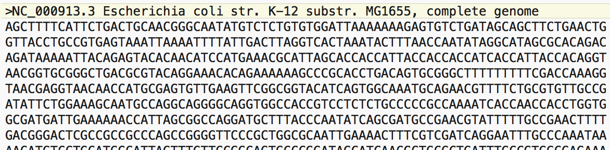

<span style="color:purple">
**Lab goals:** <br>
**1. Learn how to use lists, and understand the difference between lists and vectors.** <br>
**2. Learn how to use tables.** <br>
**3. Analyze the COVID-19 genome sequence's GC content using a sliding window approach.**
\span

<span style="color:red"> Please write all answers to the green-colored questions in either code chunks or blue text. Upload only your knitted HTML file titled "Lab3LastnameFirstname.html" to Canvas by 11:59pm CST the day after your lab. A 20% penalty will be applied for each day it is late, and no labs will be accepted after 3 days. \span  

<span style="color:purple"> This week's lab has been adopted from *A Little Book of R for Bioinformatics*, written by Avril Coghlan; Dr. Kondrashov's labs from 2015's BIOS 10602; and *Bioinformatics Algorithms An Active Learning Approach* book, written by Phillip Compeau & Pavel Pevzner. \span  

R can be a powerful tool to carry out analyses common in bioinformatics. Some well known bioinformatics packages for R are the [Bioconductor](https://www.bioconductor.org) set of R packages, which contain several packages with many R functions for analyzing biological data sets such as microarray data, and the [SeqinR](https://cran.r-project.org/web/packages/seqinr/index.html) package, which contains R functions for
obtaining sequences from DNA and protein sequence databases--and for analyzing DNA and protein sequences.  

For this lab, we're going to focus on computational analysis of biological sequence data (i.e., genome sequences). Many authors have written specialized packages for R that don't come with the standard R installation. We need to install and load the SeqinR package before we can use it. Execute the following commands in the command prompt:

```{r eval = FALSE}
install.packages('seqinr', repos='http://cran.us.r-project.org')
library("seqinr")
```

```{r echo = FALSE, message = FALSE}
#loads the "seqinr" library into the R Markdown environment
require("seqinr")
```

## Part 1 - Sequence Analysis
 
Now we're ready to start some analysis in R!

A common file format for storing nucleotide and amino acid sequences is the **FASTA** format, which can store one or more sequences along with their accompanying metadata. It begins with a single-line description starting with a ">" character followed by lines of the sequences themselves. Here is an example of a FASTA file for a nucleotide sequence:  



Indeed, we can see that there is a descriptive header line containing the accession number for this particular sequence, the name of the particular organism, and the fact that this is a complete genome for the organism. This is followed by the identities of the bases in the E. coli genome. Before we can read our COVID FASTA file into R, we need to tell R where to find this file. <span style="color:purple"> Go to the "Session" menu at the top of R Studio window, select "Set Working Directory" and then "Choose Directory". Select whichever folder you saved the E_coli.fasta file in. (Note: you can also do this directly from the R console with the `setwd()` command. For example, `setwd(~/Desktop)` would set the working directory to the desktop. You can also check your current working directory with the `getwd()` command.)

Now you can read the E. Coli FASTA format file into R using the `read.fasta()` function from the SeqinR package: \span

```{r}
e_coli <- read.fasta(file="E_coli.fasta")
```

The command above reads the contents of the FASTA format file E_coli.fasta into an R object called e_coli Let's look at what kind of data is stored in Covid:

```{r}
class(e_coli)
```

The `class()` function tells us that covid is a list variable, so let's cover a brief introduction to list variables in R before going on.

<span style="color:green"> 1.1 Define a vector in R called *myvec* containing the integers between 3 and 11. Next, use indexing to replace the fourth entry of *myvec* with the character string "Hi" (remembering to include the quotation marks to get the proper string format). Print *myvec*. What happened to the elements of the vector? Why do you think this happened? \span

The list datatype is somewhat analogous to vectors in that lists are "one-dimensional" objects, meaning that they have a `length()` attribute and one set of indices. However, lists differ from vectors because a list's elements do *not* have to share a common type. In fact, **list elements can be pretty much anything**. Consider the list constructed below:

```{r}
motleyCrew <- list(char = c("a", "b", "c"), num = 1:7, func = sample, logic = TRUE, missing = NA, numberList = list(one = 1, two = 2, three = 3))
```

```{r}
length(motleyCrew)
motleyCrew[1]
motleyCrew[c(2,5)]
motleyCrew[6]
```

As we can see from `length(motleyCrew)`, this is a 6-element list. Element 1 is a character vector, element 2 is a numeric vector, element 3 is a function, element 4 is a logical value (TRUE), element 5 is a missing value, and element 6 *is another list!* A motley crew indeed. Indexing a list can be done in a similar fashion to indexing a vector, but with one interesting feature:

**A list element accessed using a single set of square brackets**
```{r}
class(motleyCrew[1])
```
**is also of list type.**

If we wanted to get at that "b", for example, we *cannot* do the following:
```{r}
motleyCrew[1][2]
```

Instead, we need to use ***double square brackets*** to address a list element as its original type.

```{r}
class(motleyCrew[[1]])
motleyCrew[[1]][2]
```

<span style="color:green"> 1.2 Write a function that takes in a list and prints out what type of object is stored in each element of the list. Test out this function on `motleyCrew`. Hint: use a for loop and the `class()` function. \span

As you may have noticed, this list has an attribute that we have not really encountered in the objects that we have worked with so far: each element of the list has a name. To address the names of an object (either to retrieve or to assign), we can simply use the `names()` command on the object in question:

```{r}
names(motleyCrew)
```

This command returns the names of the object as a character vector.

We can use the names of the object to subset it as well. For this list, there are a couple of ways that we can do this, including:

```{r}
motleyCrew$logic
motleyCrew["logic"] #note that this is still a list object, unlike the above
```

The variable e_coli is an R list object, and the first element of the e_coli list object contains the RNA sequence we want to analyze. As we have learned, we can access this first element using double square brackets. Let's store the sequence for E. Coli in a variable e_coli_seq by doing the following assignment:

```{r}
e_coli_seq <- e_coli[[1]]
```

The variable e_coli_seq is a *vector* containing the nucleotide sequence. Each element of the vector contains one nucleotide of the sequence.

<span style="color:green"> 1.3 Using the `length()` function, determine the total number of nucleotides in the E. Coli genome sequence. \span

<span style="color:green"> 1.4 Print out the last 26 nucleotides of the E. Coli genome sequence. \span

## Part 2: Basic DNA analysis

### Complementary Strand
In bioinformatics, since a single strand of DNA usually gives all the information necessary about its complementary strand, DNA sequences are represented as single strands in databases. Sometimes, however, it is relevant to consider the complementary strand of a DNA sequence, and for that one has to construct the complementary strand. First, note that you will need to change each base for its complementary base pair. Second, a complementary strand runs in the reverse direction of the strand which it complements, and it is therefore also necessary to reverse the direction of the DNA sequence.

<span style="color:green"> 2.1 Write a function `compStrand()` such that, given a DNA sequence, it outputs the complementary strand. Test your function on the following sequence. *(Note: The convention for writing any nucleotide sequence is to go from the 5' to 3' end. Keep this in mind as you determine how to report the complimentary sequence.)* \span

```{r}
init_strand <- c("c", "g", "a", "g", "a", "c", "a")
```

### Counts and Frequencies
An obvious first analysis of any genome sequence is to count the number of occurrences of the four different nucleotides ("A", "C", "G", and "T"). Before we get to doing that, take a look at the code below to get an idea of one way we can do this using tables:

```{r}
names <- c("Mary", "John", "Ann", "Sinead", "Joe", "Mary", "Jim", "John", "Simon")
table(names)
```

We can store the table produced by the function `table()` in a variable by typing:

```{r}
mytable <- table(names)
```

To access elements in a table variable, we need to use double square brackets, just like accessing the elements in a list. For example, to access the fourth element in the table (the number of children named John), we type:

```{r}
mytable[[4]]
```

Alternatively, we can use the name of the fourth element in the table (John) to find the value of that table element:

```{r}
mytable[["John"]]
```

A basic property of genetic sequences which can be quite useful to know is the frequency of each of the four nucleotides. In this section, we ask you to use your knowledge of R to write functions which will be able to do so.

<span style="color:green"> 2.2 Find the individual nucleotide counts for the E. Coli genome. What would the counts be for a DNA strand complimentary to this one? \span

<span style="color:green"> 2.3 Write a pair of functions called `frequencyAdenine()` and `frequencyThymine()` such that, given a nucleotide sequence, they will output the respective frequencies of Adenines and Thymines. \span  

<span style="color:purple"> According to [ThermoFisher Scientific](https://www.thermofisher.com/us/en/home/references/ambion-tech-support/rna-tools-and-calculators/dna-and-rna-molecular-weights-and-conversions.html), the molecular weights of A, T, C, and G, respectively, are 313.2, 304.2, 289.2, and 329.2 amu for DNA. For RNA, the respective weights for A, U, C, and G are 329.2, 306.2, 305.2, and 345.2 amu. \span

<span style="color:green"> 2.4 (a) Why are the masses of Ribonucleotide Monophosphates and Deoxyribonucleotide monophosphates different?  \span

<span style="color:green"> (b) For a first application of the ideas from 2.3, write a function called `seqWeight()` that, given a nucleotide sequence, outputs its weight. Your function should have an optional parameter *type* that by default is set to type = "DNA". This can be accomplished by simply providing `type = "DNA"` in the list of parameters during function definition. But, if type = "RNA", then it interprets seq to be an RNA sequence and outputs the appropriate weight. \span  

<span style="color:green"> (c) To test your function, report the weight of the following DNA sequence:
\span  
```{r}
seq <- c("g", "g", "t", "a", "t", "t", "c", "c", "g", "a", "g", "a", "c", "a")  
```

### GC Content of DNA
One of the most fundamental properties of a genome sequence is its **GC content**, the fraction of the sequence that consists of Gs and Cs (as opposed to As and Ts). <span style="color:purple"> The GC content can be calculated as the ratio of the bases in the genome that are Gs or Cs to the total number of bases in the sequence (i.e., the length). \span 

<span style="color:green"> 2.5 Write a function called `GC_Content()` that will take in as its argument a nucleotide sequence and then return its GC content. Test your function on the E. Coli sequence. What is the GC content for the E. Coli genome? SeqinR has a built in function `GC()` which gives the fraction of bases in the sequence that are Gs or Cs. Does the `GC()` function give you the same output as your `GC_Content()` function for the E. Coli genome? \span

We just found the GC content of the whole E. Coli genome, but there is probably local variation in GC content within the genome. That is, some regions of the genome sequence may have GC contents quite a bit higher than your result from exercise 2.5, while some regions may have GC contents that are quite a bit lower. <span style="color:blue"> Local fluctuations in GC content within the genome sequence can provide interesting information, such as cases of horizontal gene transfer  ([https://en.wikipedia.org/wiki/Horizontal_gene_transfer](https://en.wikipedia.org/wiki/Horizontal_gene_transfer)) or biases in mutation. \span

If a chunk of DNA has moved via horizontal transfer from the genome of a species with low GC content to a species with high GC content, the chunk of horizontally-transferred DNA could be detected as a region that is unusually low in GC content in the high-GC species. On the other hand, a region of unusually low GC content in an otherwise high-GC content genome could have arisen due to biases in mutation in that region of the genome; for example, it could be the case that mutations from Gs and Cs to Ts and As are more common for some reason in that region of the genome than in the rest.  

In order to study the local variations of GC content within a genome sequence, we could calculate the GC content for smaller chunks of the genome sequence. Let's calculate the GC content of the first 28000 nucleotides of the E. Coli genome over seven 4,000-nucleotide chunks:
```{r}
GC(e_coli_seq[1:4000])
GC(e_coli_seq[4001:8000])
GC(e_coli_seq[8001:12000])
GC(e_coli_seq[12001:16000])
GC(e_coli_seq[16001:20000])
GC(e_coli_seq[20001:24000])
GC(e_coli_seq[24001:28000])
```

The above calculations didn't cover the entire genome sequence, but we can see that there indeed seems to be some local variation in GC content within the E. Coli genome sequence.

<span style="color:purple"> This analysis of local variation in GC content is known as a "sliding window" analysis. \span <span style="color:black"> By calculating the GC content in each 4000-nucleotide chunk of the E. Coli genome, we could analogously say that we are sliding a 4000-nucleotide window along the DNA sequence in 4000-nucleotide steps from start to end and calculating the GC content in each frame. But, of course, there is nothing stopping us from using a window size of 1000 or sliding along the sequence in steps of 500 or even 1. \span

<span style="color:green"> 2.6 Write a function `windowStartPositions()` that takes a nucleotide sequence's length, a window size, and a step size as arguments and outputs a sequence of numbers containing the starting nucleotide position of each window that fully fits within the sequence. To give an example, for the E. Coli virus genome, if both the window size and step size are 4000, the vector of starting positions would be {1, 4001, 8001, 12001, 16001, 20001, 24001, ..., 4636001) and would not include 4640001 because 4640000:4641652 is not a full 4000-nucleotide window. Alternatively, if the window size was 4000 and the step size was 1000, the starting positions would be {1, 1001, 2001, 3001, 4001, 5001, 6001, 7001, 8001, 9001 , ... , 4637001}. Hints: a window starting at position `i` with a window size of `n` will span from `i` to `i + n - 1`; for a given window size `n`, the last possible valid window spans from `length(sequence) - n + 1` to `length(sequence)`. \span

<span style="color:green"> 2.7 Write a function `slidingGC()` that takes a nucleotide sequence, a window size, and a step size as arguments and outputs a numeric vector containing the GC content of each window. This function should provide output consistent with the examples provided above in 2.6. \span

<span style="color:purple"> It might be helpful to use the data generated from a sliding window analysis to create a sliding window plot of GC content. \span <span style="color:black"> To do this, we can plot the local GC content in each window of the genome on the y-axis against the nucleotide position of the start of each window. \span

<span style="color:green"> 2.8 Write a function `plotSlidingGC()` that takes a nucleotide sequence, a window size, and a step size as arguments and plots a scatter plot of the GC content of each window against the starting nucleotide position of each window. For plotting, provide the arguments `pch = '.'` and `type = "o"` to the `plot()` command. Use this function on `e_coli_seq` with varying window sizes and step sizes. Briefly describe how window size and step size affect the information available from the resulting plots.

## Part 3: Finding the origin of DNA replication (*oriC*)

### Finding *oriC*

The next question tries to use the tools you have learned and developed to try to address an important question: **Where is the origin of DNA replication?**

<span style="color:blue"> Watch the DNA replication video in the lab folder and read the "Oric-explenation" document. \span

We will try to do this in the bacterial genome, which usually has only one chromosome. The bacterial genome, different from that of animals, plants, fungi and archea, is usually circular. This slightly complicates the analysis, since there isn't a point where it starts or ends, and it isn't easy to handle circular data. Hence, we are going to handle bacterial genomes as DNA sequences, as if the circular genome had been cut at an arbitrary point. Replication is fundamental for the maintenance of life, and, hence, finding the point where it starts in the genome could be key to understanding certain life processes. DNA replication is performed by enzymes called DNA polymerases. They do this by first binding to specific regions of DNA, splitting the two strands of DNA, and then finally creating new strands, one for each of the original strands. In this way, DNA replication is "semi-conservative". Our question is, then, where does replication start? We will call the region where replication starts **oriC**. There are ways of finding *oriC* experimentally, but these methods are much slower. If we could search for *oriC* using computational methods, even though we may not be capable of getting the exact region using such an approach, we could help a lot in speeding up the experimental approaches.  

   

One approach to finding *oriC* is to try to find some words in the bacterial genome that could correlate with the start of the replication regions. This could be done statistically, by finding **unusually** frequent words (in the sense that it is more frequent in the DNA genome than in a randomly generated sequence of the letters "A", "G", "C", and "T" of the same length) clumping together within short regions of the genome. We are going to instead use an approach based on the content of guanine and the content of cytosine in the genome--implementing the sliding window approach discussed above.  

But why should the frequencies of G and C help settle this question? This was hinted at in the lab. It turns out that replication generates mutational anomalies due to the asymmetry of replication. This is because DNA polymerase is *unidirectional*; it can only transverse DNA in the reverse direction (from 3' to 5'). This causes no problem for the reverse half-strand, but the forward half-strand, which is unraveled for replication from 5' to 3', can't be replicated from the start; it must wait until there is enough space for the DNA polymerase (these enzymes are huge biological machines, and need a fair amount of space before binding) to bind a few nucleotides down the road and then be able to replicate the short segment that was unraveled thus far in the direction 3'-> 5'.
These generates several phenomena in DNA, such as the famous [Okazaki fragments](https://en.wikipedia.org/wiki/Okazaki_fragments). What is relevant to us, though, is that--because of this--the forward half-strand spends much more time single stranded than the reverse half-strand. And single-stranded DNA has much higher mutation rates than double-stranded DNA! <span style="color:red"> **Specifically, C tends to mutate into T by a process called deamination** \span. 

The rate of deamination in single-stranded DNA is 100 times higher than in double-stranded DNA. This creates mismatched "T-G" pairs, which are then corrected in the next replication into T-A pairs. It should be the case then, that in the forward half-strand, the G content should be low in relation to the C content, and the opposite behavior in the reverse half-strand (because the forward half-strand of the complementary strand pairs with the reverse half-strand of the original strand). In particular, `G_content(genome)-C_content(genome)`, for some genome, should be smallest close to the *oriC*, since *oriC* is the point that separates the beginning of the reverse half-strand and the end of the forward half-strand. **Remember that, as a convention,the sequences are always reported from 5' to 3' direction.**

<span style="color:green"> 3.1 With all of this said, let's analyze a well-studied genome: *Sulfolobus solfataricus*. \span

<span style="color:green"> (a) Put the *Sulfolobus solfataricus*, *Thermotoga petrophila* and *Covid* in your working directory. \span 

The following code loads all of these files into R. You will learn how to do all of this by yourself (including finding the genomes) in the next lab.  

```{r}
s_solfataricus <- read.fasta("Sulfolobus solfataricus.fasta")[[1]]
t_petrophila <- read.fasta("Thermotoga petrophila.fasta")[[1]]
covid <- read.fasta("covid19.fasta")[[1]]
```

<span style="color:green"> (a) What we will do is try to find the point where the difference between the G and C content achieves a minimum. For that, write a function called `skew()` that receives a vector of characters as input (which in our case will be a whole bacterial genome) and a positive integer i. Your `skew()` function should then output the difference between the G count and the C count from the first nucleotide in the DNA sequence up to nucleotide number i (for i = 0, define the skew to be 0).  \span  

<span style="color:green"> (b) Now, write a function called `skewDiagram()` that, given a DNA sequence, outputs the skew diagram of the DNA sequence. A skew diagram is a plot that has on the x axis positive integers (with x ranging from 0 to the length of the DNA sequence), and on the y-axis the skew of the DNA sequence up to the index x. Hint: This is the first time in this course you are going to face genomical analysis. One of its challenges is that genomes are huge. Even a bacterial genome might be non-trivial to a personal computer. **Therefore, your implementation of the algorithm might affect a lot the time you spend in this lab.** Think carefully on how to implement your function. First of all, do not recount G and C every time you need to compute some skew. Instead, find a way of just updating previous skews. (**NOTE: to make this execute in << tens of minutes, plot `skew[seq(1, length(skew), 8000)]` vs. `seq(1, length(skew), 8000)`). Additionally, it may be useful to create a helper function to generate the skews to be plotted on the x axis and simply call it in the body of `skewDiagram()`. Be sure to ask to your TA for help if needed. \span 

<span style="color:green"> (c) Write a function `min_skew` that, given a DNA sequence, finds the i such that `skew(DNA, i)` is the minimum among all possible i. \span  

<span style="color:green"> (d) Now, use the functions you just wrote to analyze the genome of *Sulfolobus solfataricus*. Given the skew diagram of *Sulfolobus solfataricus*, report **and justify** where you expect *oriC* to be located in the *Sulfolobus solfataricus* genome (notice that the minimum may differ from *oriC* due to random fluctuations in the G or C frequencies, hence, you should really indicate a short region rather than a point). You can see on the skew diagram of *Sulfolobus solfataricus* that there are three clear valleys where you can identify local minima. What might this indicate? Try to find published experimental evidence that proves your hypothesis. \span

<span style="color:green"> 3.2 Now, load the genome of *Thermotoga petrophila* and plot its skew diagram. Where would you expect the *oriC* of *Thermotoga petrophila* to be? Explain your answer.\span

<span style="color:green"> 3.3 Load the genome of the archea *Covid* and plot its skew diagram. Notice that you might want to change the value 8000 to something like 100 in seq(1, length(sequence), 8000) and skewVector[seq(1, length(sequence), 8000)], as the Covid sequence is not as large as the previous ones we analyzed. Explain your answer.\span