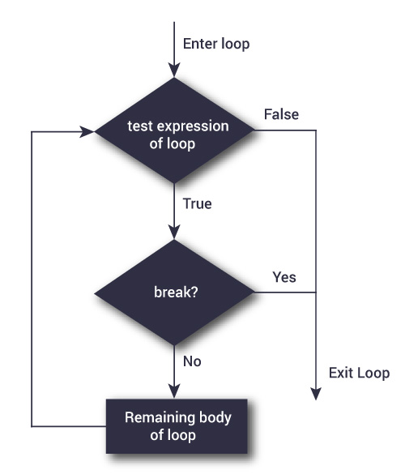

<span style="color:purple">
**Lab goals:** <br>
**1. Learn string manipulation, value matching, and the break command** <br>
**2. Find Open Reading Frames (ORF) for a given sequence** <br>
\span

<span style="color:red"> Please write your answers to all questions (green) in either code chunks or blue text in the provided answer file. Upload a knitted html file titled "Lab4LastnameFirstname.html" to Canvas by 11:59pm CST the day after your lab. There is a 20% penalty for each late day, and no labs will be accepted after 3 days. \span  


### Part 1: Pasting strings, value matching, and break
#### Pasting strings

To help us conduct more genome analysis, we are first going to learn some more important functions in R. Let's start with `paste()`.

The `paste()` function is a built-in function in R that is used to **concatenate strings**. This is to say that `paste()` takes separate strings such as `"cat"` and `"dog"` and *pastes them* together into a single string like `"cat dog"`. It's sort of like `c()` for strings. 

```{r}
pasted <- paste("cat", "dog")
pasted
```

`paste()` takes two additional arguments called `sep` and `collapse`. `sep` is used when you want to paste together two **separate** strings, as we did in the example above. It determines what character is used to paste the strings together; by default, the character is a space `" "`. `paste0()` is a variant of `paste()` where `sep = ""` (the empty string)

```{r}
paste("cat", "dog", sep = "!")
paste0("cat", "dog")
```

If we want to paste together strings that are contained in a **character vector**, then we need to provide the `collapse` argument:

```{r}
paste(c("cat", "dog"))
paste(c("cat", "dog"), collapse = " ")
```

<span style="color:green"> 1.1 Using the `paste()` function, write a command that will generate a grammatically correct sentence that mentions today's date, making sure to use appropriate spacing and punctuation. You can use more than one command to put the sentence together if desired. \span


#### Value matching

Let's also look at another operation: `%in%`. Value matching returns a logical vector that indicates whether the elements in argument `x` exist in another argument `y`. Note as well the difference between the following two commands.


```{r}
c(1,3,5,9) %in% 1:10 #take each element of the right side to find a match on the left side. 
```

```{r}
1:10 %in% c(1,3,5,9)
```


<span style="color:green"> 1.2 Analyze the code below. Describe the outputs of each command, and explain how they differ.\span

```{r}
c <- 5:25
d <- c(-2, 15, 8, 33, -8)

c%in%d
d%in%c
```


#### Break function

The last new concept we will learn before diving into ORF analysis is `break`. `break` statements are used inside a loop to **break** out of it. It does not return a value; it stops the iterations and transfers the control of the loop to outside of the loop. In a nested loop, the statement exits from the inner-most loop to the first statement outside. 



<span style="color:green"> 1.3 Explain the for loop and its output below. How do you think the break function worked? \span

```{r}
for(i in 1:100){
  if(i==7){
    break
  }
  print(i)
}
```

### Part 2: Open reading frames
#### The Central Dogma

Our genes contain the blueprint for our cells and our bodies. In today's world, this is common knowledge. But what may be less obvious is exactly *how* those sequences of DNA exert their effects in the physical, biological world. The short story is that the plan contained in DNA is put into action by proteins, but this idea brings us to a fundamental teaching in modern biology: **the central dogma of molecular biology**. As originally stated in Francis Crick's (of Watson and Crick fame) 1958 [paper](https://profiles.nlm.nih.gov/spotlight/sc/feature/doublehelix) "On Protein Synthesis", the central dogma *"...states that once 'information' has passed into protein it cannot get out again. In more detail, the transfer of information from nucleic acid to nucleic acid, or from nucleic acid to protein may be possible, but transfer from protein to protein, or from protein to nucleic acid is impossible. Information means here the precise determination of sequence, either of bases in the nucleic acid or of amino acid residues in the protein."*

A consequence of this statement--with the benefit of some additional information from experimental biology since 1958--is the following: **The flow of information during protein synthesis is *from DNA to RNA to Protein***. We've touched upon DNA and proteins, but what is this RNA intermediary? The first step on the path from DNA to protein is for the double-stranded DNA to be **transcribed** to form a single-stranded mRNA (messenger RNA) molecule. A big benefit of this transcription step is that *many mRNA molecules can be repeatedly transcribed from DNA*, allowing for **amplification**. 

To illustrate the benefits of amplification, imagine if every high schooler in the United States had to be taught biology from a *single physical copy* of a textbook. Learning anything would be practically impossible! Similarly, if proteins were created directly from DNA, then the resulting traffic jam in the nuclei of our cells would make cellular processes slow to a crawl. Instead, by first transcribing to an mRNA intermediary, cells are able to quickly manufacture key proteins in large quantities. We are able to make photocopies of that precious, precious textbook. 

However, we encounter a slight problem, because there are four nucleic acids used in our genetic code (ATCG for DNA, AUCG for RNA), but there are 20 (sometimes more!) amino acids used in the construction of our proteins. A one-to-one translation would be clearly impossible. Instead, to translate from mRNA to protein, **three nucleotides code for one amino acid**. Strings of these **triplet codons** form the **protein-coding regions** of our genes. A table of codons follows:


So there is the mRNA code to protein code translation problem solved. But how do we know where the protein-coding regions begin? Another problem. There are many different markers that tell us where protein-coding regions reside in our genomes, but a basic and important one that helps us to predict the locations is the concept of the **open reading frame** or **ORF**, a string of nucleotides that starts with a **start (AUG)** codon and ends with a **stop (TAA, or TAG, or TGA)** codon. 

### Open Reading Frames

A large number of protein sequences start with Methionine. From the table, we can see that the codon for Methionine is AUG (ATG in DNA code), and is also labeled as "Start". But Methionine is also an important amino acid *within* protein structures. How do we then determine where a protein begins? The truth is that, based on the genetic code alone, this is a difficult task. But we can predict where protein-coding regions begin and end because all protein sequences also end in one of three codons: UAA, UAG, or UGA (TAA, TAG, and TGA in DNA code). These are the **stop codons**. They do not normally code for amino acids but rather serve to signify that translation of the protein will terminate at that position. ***If a stop codon is encountered by protein-forming machinery, then translation *will stop**.

<span style="color:blue">
So a structure for an open reading frame begins to appear: a start codon, some number of intervening codons that code for the amino acids of the protein, and a stop codon to terminate the sequence. All of these components are formed from three-nucleotide codons, so a key property of these frames is that **their length in nucleotides is evenly divisible by 3**.\span

Another problem emerges. There are three different "frames" possible for a given direction. To explain:

Consider the sequence "GTCATGAT". If we start from the first nucleotide "G" and start assigning codons, then we get the following: **(frame 1) GTC ATG, or Valine Methionine**. Let's start at the second nucleotide: **(frame 2) TCA TGA, or Serine STOP**. And if we start at nucleotide 3: **(frame 3) CAT GAT, or Histidine Aspartate**. Note that if we start at the fourth nucleotide, we are ***in reading frame 1 once again***: ATG. All of this also applies to the complementary strand, **so for a double-stranded genome, there are six possible reading frames**.

From this, we can see that if we want our open reading frames to begin with the start codon (ATG) and end with one of the stop codons (TAA, TAG, or TGA), then we will need our start and stop codons to be **in the same reading frame**. This means that the length spanned by our open reading frame (first nucleotide of start codon to final nucleotide of our stop codon) must be evenly **divisible by 3**.

The final condition is that our ORFs **must be of some minimum length with no intervening in-frame stop codons.** This means that our ORFs must code for a certain number of amino acids so that the product will be a polypeptide of significant length that fold to a structure properly. **If there is a stop codon in-frame between our chosen start and stop codons, then that ORF would terminate by definition at that intervening stop codon, so our putative ORF is not valid.**
All together the general strategy to determine the ORF is as follows:

To summarize, our general strategy is delineated below:

1) Beginning at the first nucleotide in the sequence (i.e. in reading frame 1), move along one codon (3 nucleotides) at a time until you encounter a start codon.
    a) Once you have found a start codon, begin building your potential ORF by checking subsequent codons to see whether a stop codon follows. Make sure to keep track of how many codons are in this potential ORF.
        i) If you find a stop codon, then check to see if your potential ORF meets the minimum length requirement. If it does, then store the nucleotide range from the first nucleotide of the start codon to the final nucleotide of the stop codon.
        ii) Resume your search for start codons at the codon after this stop codon.
2) Repeat this search for reading frames 2 and 3 (i.e. beginning at nucleotides 2 and 3).


As a first step towards our ORF analysis, let's start by writing two functions, `findStartCodons()` and `findStopCodons()`. Given a DNA sequence, these functions will find the positions of the first nucleotide of each start and stop codon, respectively, regardless of the reading frame (1, 2, or 3). **Make sure to delete the `eval=F` in the code chunks below so that they run when you knit.**

<span style="color:green"> 2.1 a) Write a function that takes in a gene sequence and stores the indices of the first nucleotide of the start codon in the vector `startcodons`, and returns this vector at the end. Note that the DNA sequences we will use will contain lower case characters, i.e. "a", "t", "g", "c". The last 2 lines in the chunk will test your `findStartCodons()` function on a sample sequence called `seq`. Pseudocode is given below to help guide you, but you are free to write in your own style. *Hint: use a nested if statement inside a for loop to iterate over the entire sequence and evaluate whether the letters are "a", "t", "g" using truth statements (`&&` and `==`). USE LOWERCASE LETTERS* \span


```{r,eval=FALSE}
findStartCodons <- function(seq){
  startcodons <- numeric(0) #This will initiate an empty vector. You can index into this vector at any location to store a new value. I.e. to store a value of 100 in the first position of this vector, you would index into the first location in `startcodons` and set it equal to 100.
  k <- 1 #use k to index the 'startcodons' vector (startcodons[k]) as you store in it the index of each start codon you find in 'seq'. Remember to increase k each time (k<-k+1). 
  for(i in 1:(length(seq)-5)){
    
  
  }
  return(startcodons)
}

#Testing the function
seq<-c("g", "t", "a", "a", "t", "g", "t", "a", "g", "t", "g", "a", "t", "t", "g", "t", "a", "g")
findStartCodons(seq)

```

<span style="color:green"> In 2.1(b), The for loop iterated over `1:(length(seq)-5)`,whereas in 2.1(c), it will iterate over `1:(length(seq)-2)`.. Explain the logic behind this difference. (Hint: to understand `1:(length(seq)-5)` in 1c, think about where the start and stop codons must fall in order for them to create an open reading frame.) \span

<span style="color:green">2.1 c) Write a function that takes in a gene sequence and stores the indices of the first nucleotide of stop codons in the vector `stopcodons`, and return this vector at the end. Pseudocode is given below to help guide you, but you are free to write in your own style. Remember that there are three different stop codons! *Hint: some ways of doing this include using the OR statement (`||`), or multiple if statements.*\span

```{r,eval=FALSE}
# This function receives a DNA sequence as input and outputs a vector with the position of all stop codons.

findStopCodons <- function(seq){
  stopcodons <-numeric(0)#This will initiate an empty vector. You can index into this vector at any location to store a new value. For example, to store a value of 100 in the first position of this vector, you would index into the first location in stopcodons and set it equal to 100.
  k <- 1
  for(i in 1:(length(seq)-2)){ 
        
  }
  return(stopcodons)
}
#Testing the function
seq<-c("g", "t", "a", "a", "t", "g", "t", "a", "g", "t", "g", "a", "t", "t", "g", "t", "a", "g")
findStopCodons(seq)
```


<span style="color:green"> 2.2 Write a function to find possible open reading frames (ORFs) in a given sequence. Let us define those to be a substring starting with the start codon "AUG" and ending with one of the stop codons and whose **length is divisible by 3** so it can be a coding sequence and **without any intervening in-frame stop codons**. 
<br>
The inputs should be a nucleotide sequence and a minimum length for the ORF codons. Typical proteins have a minimum length of **100 amino acids** (that is coded by 300 nucleotides); therefore we like our code to have an argument to reflect this minimum length. The code output should be a **character vector** containing strings of the following format (see `?paste`): `"<first base of start> to <last base of stop>"` (e.g. `"409 to 1273"`). 
<br>
A pseudocode sketch of a possible code implementation is given below; you are free to come up with your own original code, as long as it works. (Hint: you should be using `findStartCodons()` and `findStopCodons()` in your ORF function.) **Make sure to set eval to TRUE after finishing the function.**

```{r eval = FALSE}
##Make sure to set eval to TRUE after finishing the function.

findORF <- function(seq, minLength){ # minLength is the minimum number of codons in our ORF
  startcodon<- # store all the start codons to analyze in this function
  stopcodon<- # store all the stop codons to analyze in this function
  usedStop<-numeric() #after a stop codon has found as being in an ORF, we will store it here
  ORFs<-character() #we will store all ORFs here
  k<-1
  for (){ # for every start codon
    for(){ # for every stop codon that sequentially comes after the start codon
     if (){ #if the distance between the start and stop codons are in the same reading frame and the stop codon comes after the start codon
       if (){ # if the stop codon has already been used
         break #go back to outside of this for loop
        } else if (){ # if the distance between the start and stop codon is insufficient, then break
          break
          } else { # if the stop codon has not been used and the distance between them is sufficient
            # store the position of the first nucleotide of the start codon and the last nucleotide of the stop codon in the right format (ex. "41 to 1423", as a string) into the empty vector 'ORFs'
            # store the stop codon in the usedStop vector so we don't use it again
            k<- k + 1
            break 
         }
      }
    }
  }
  ORFs<-ORFs[ORFs!=""]
  return(ORFs)
} 
```


<span style="color:green">2.3 Use the function you wrote above to calculate the possible ORFs with a minimum length of 200 (triplet, 600 nucleotides) codons in the zika virus genome. Please **display your results**. Note: You will need to **load the genome** (stored in 'Zika.fasta') into R using `read.fasta()` from `library(seqinr)`. See Lab 3 for a refresher on syntax. \span

<span style="color:green">2.4 Do you find the number of ORFs surprising **considering the number of proteins coded by the virus**? Do some research into how the zika genome is organized and expressed (you may find [this page](http://viralzone.expasy.org/6756?outline=all_by_species) useful). With this information in mind, justify the number of ORFs you found in question 2.3. (Note: pay attention to the biological mechanism of the genome expression.) \span

<span style="color:green">2.5 Use the function you wrote above to calculate the possible ORFs (minimum length of 100, that is, 300 nucleotides) in the coronavirus genome. Note: You will need to **load the genome** (stored in 'covid19.fasta') into R using `read.fasta()` from `library(seqinr)`. \span

<span style="color:green">2.6 Do you find the number of ORFs surprising in in the coronavirus genome **considering the number of proteins coded by the virus**? Do some research into how the coronavirus genome is organized and expressed (you may find [this page](https://www-ncbi-nlm-nih-gov.proxy.uchicago.edu/pmc/articles/PMC7525243/) useful). With this information in mind, justify the number of ORFs you found in question 2.5. \span

<span style="color:green">2.7 Use the function you wrote above to calculate the possible ORFs (minimum length 50, that is, 150 nucleotides) in the HIV virus genome. Note: You will need to load the genome (stored in 'HIV.fasta') into R using `read.fasta()` from `library(seqinr)`. Compare the number of ORFs you find to the number of genes known to be encoded by the HIV genome. Propose a reason for how there are more proteins produced by HIV than the number of its genes.\span


### Part 3: Further Open Reading Frame Analysis

The file ORF.R (sourced below) contains the function `findORF()`, which is an "R-optimized" algorithm for finding ORFs in nucleotide sequences. We suggest that you take a look at the code, but we do not expect that you will understand everything that is being done. The reason we provide this code is that it would take somewhere on the order of dozens of minutes for our loop-based algorithms to run on the full E. coli genome in R due to language overhead. If you wish to verify this with your own functions, then you may of course attempt it, but keep in mind that your R session may become unresponsive or crash if you followed the code skeleton in Lab 4.

The usage of `findORF()` is very similar to the algorithms that we coded in lab, with the inputs being a nucleotide sequence in the form of a character vector and a minimum length. Here, we are finding the ORFs in the first 10,000 bases in the forward direction of the E. coli genome, which has been loaded into R as the variable `ecoli`.

```{r}
source("ORF.R")
ecoli <- seqinr::read.fasta("E_coli.fasta")[[1]]
findORF(ecoli[1:10000], 100)
```

<span style="color:green"> 3.1. Use `findORF()` to find the ORFs that have a minimum length of 600 nucleotides in the forward strand of the E. coli genome, and store it in a variable `E-coli-ORF`. This may take a few seconds to run. **Please** do not print out every ORF you find! </span>


<span style="color:green"> 3.2. Sort the rows of `E-coli-ORF` by ORF length. See the example below for a potential implementation.</span>

```{r}
#Generate test object; don't need to fully understand
cats <- data.frame(Name = c("Fluffy", "Tabby", "Enrique", "Madam Winthrop", "Steve"), Cuteness = 1:5, Weight = ceiling(runif(5, 0, 30)))
cats

#Order by values in "Weight" column
catsByWeight <- cats[order(cats$Weight, decreasing = T),]
catsByWeight
```

```{r}
#Your code here
```

<span style="color:green"> 3.3 (a) Use the `head()` function on your sorted data frame to output the first few longest ORFs in the forward strand of the E coli genome. </span>

<span style = "color:green"> (b) Navigate to [https://biocyc.org/ECOLI/select-gen-el](https://biocyc.org/ECOLI/select-gen-el) and enter the nucleotide ranges for a few of these longest ORFs. Click on the ribbons representing these coding regions to get more details about the gene products (proteins). Choose a gene product of interest and briefly summarize its function. </span>

`ORF.R` also contains a function `compStrand()` to output the complementary strand of a nucleotide sequence inputted as a lower-case character vector.

<span style="color:green"> 3.4 (a) Use `compStrand()` and `findORF()` to calculate the ORFs of length >= 600 nucelotides in the forward and reverse strand of the Staphylococcus aureus genome and output the data. </span>

<span style="color:green"> (b) The genome of the Staphylococcus aureus is known to contain ~2,800 protein coding genes. Compare the number of ORFs you found to this value and propose an explanation for any discrepancy. You can access the information on Staphylococcus aureus on NCBI through [this link](https://www.ncbi.nlm.nih.gov/genome/?term=Staphylococcus+aureus) </span> 
