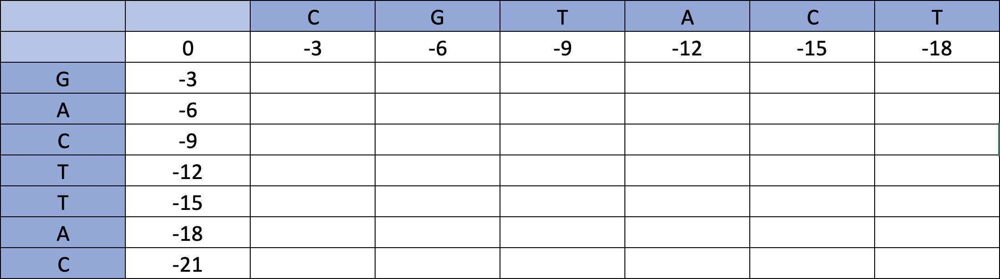
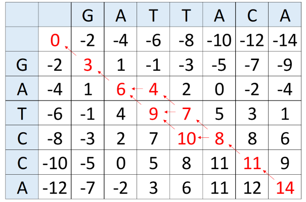

```{r, include=FALSE}
install.packages('seqinr', repos='http://cran.us.r-project.org')
library(seqinr)
```


<span style="color:purple">
**Lab goals:** <br>
**1. Understand the application and implementation of sequence alignment** <br>
**2. Implement the Needleman-Wunsch algorithm to find the optimal global alignment between two sequences** <br>
**3. Analyze DNA words and utilize the rho function**
\span

<span style="color:red"> For this lab, provide answers to all green questions in either blue text responses or code chunks. Please upload a knitted html file titled "Lab5LastnameFirstname.html" to Canvas by 11:59pm CST the day after your lab. There is a 20% penalty for each late day, and no labs will be accepted after 3 days. \span

**Sequence alignment** refers to the process of arranging different amino acid or nucleic acid sequences relative to one another to identify regions of similarity. Alignment is used to assess the evolutionary relatedness of sequences and highlight regions of potential functional or structural importance. Sequence alignment algorithms are leveraged in numerous biological applications, including phylogenetic analysis; gene functional prediction; genome assembly; transcriptome analysis; detection of single nucleotide polymorphisms (SNPs); protein structural prediction; and many other applications in molecular evolution and molecular biology.  

For a brief example of the process of sequence alignment, take the following two protein sequences. It is clear that they contain many identical amino acids across the length of the sequence. However, since the sequences are of different lengths, a direct superimposition of amino acid positions only uncovers three identical amino acids (colored in red):  

<span style="color:red">L E V<span style="color:black"> T K G G Q R K D R R  \span    

<span style="color:red">L E V<span style="color:black"> G M T K G G Q R K E R R  \span  

Clearly, this direct comparison is not the best way to assess the relatedness of these two sequences. As humans capable of abstract reasoning, we can quickly see that it appears that these two sequences actually differ in one fundamental way: one sequence underwent an insertion (or a deletion, depending on the polarity of the change) event that did not occur in the other. Therefore, we can indicate the presence of a **gap** (represented by the --- character) in the shorter sequence to increase the number of pairwise identities in these sequences:  

<span style="color:red">L E V <span style="color:black">---<span style="color:red"> T K G G Q R K<span style="color:black"> D<span style="color:red"> R R\span  

<span style="color:red">L E V<span style="color:black"> G M<span style="color:red"> T K G G Q R K<span style="color:black"> E<span style="color:red"> R R\span  


It is apparent that these two sequences are likely related to each other evolutionarily--that is, they share many amino acid identities due to the presence of a common ancestor with the same amino acid pattern. <span style="color:purple"> Evolutionary convergence by random chance to a 15-amino acid sequence with 80% identity is an extremely unlikely scenario, and thus we conclude that these two sequences are related. Furthermore, based on the distribution of amino acid states, we can infer the sequence attributes of this peptide that are important. For example, if we believe that both protein sequences fulfill a similar biological function, we can conclude that the 'GM' motif in the second protein is not essential for this function. Similarly, we can conclude that at position 13 in the alignment, while strict conservation is not necessary, a negatively charged amino acid side chain might be functionally important. \span

In this toy scenario, we were able to derive the optimal alignment by eye. However, the relationships between real sequences are rarely so straightforward. As such, many computational approaches have been devised for determining the optimal alignments between protein or nucleic acid sequences. In this lab, we will learn the basic algorithm for **global pairwise sequence alignment**, which seeks to determine the optimal mapping between **entirety** of two sequences. Next week, we will introduce the **local pairwise sequence alignment** and **multiple sequence alignment**.

## Part 1: Global Pairwise Sequence Alignment

In a pairwise sequence alignment we seek to identify the optimal mapping between two sequences. In particular, we might want to know whether the degree of similarity between two sequences is greater than expected by chance, implying divergence from a common ancestor via mutation and fixation. Pairwise sequence alignments come in two primary flavors: **global alignment**, which attempts to align the entire lengths of two sequences from start to finish, and **local alignment**, which attempts to uncover subsets of one or both sequences which are similar to one another. <span style="color:purple"> Global pairwise alignment is appropriate when you expect that the entire sequence on hand is likely to be related through evolutionary history. Local pairwise alignment is appropriate when you expect only a portion of the sequence to be related through linear evolution. \span

<span style="color:green"> 1.1 Suppose we want to compare the sequence similarity between two protein sequences that share a conserved DNA-binding domain, which has independently recombined with non-homologous regulatory domains in each lineage. Should we use global or local pairwise alignment to determine the similarities between the DNA-binding domains and why? \span


The problems of both global and local pairwise alignment can be solved through well-established **dynamic programming algorithms**. For global alignment, we will introduce and implement the **Needleman-Wunsch algorithm**. If at any point you need help with this algorithm check  [here](https://en.wikipedia.org/wiki/Needleman%E2%80%93Wunsch_algorithm). <span style="color:purple"> This dynamic programming algorithm is guaranteed to find the optimal alignment between two sequences. \span

 The goal is to assign a relative **score** to a particular alignment between protein or DNA sequences, with more positive scores reflecting patterns that are expected in a case of common ancestry and more negative scores attributed to patterns that are inconsistent with common ancestry. In the case of a DNA sequence alignment, a reasonable scoring system might attribute a score of +4 to a sequence match, +2 to a mismatch, and -3 to a gap. These scores are summed across columns in the alignment.

<span style="color:green"> 1.2 Given the scoring scheme above, compute the alignment scores of the following three sequence alignments. \span

<span style="color:green">
a.  
G A C T T A C A  <br>
G A - T T C A A  \span   
    
<span style="color:green">
b.  
G A A T T - C A T  <br>
G A - T T - T A A \span
    
<span style="color:green">
c.  
G A C A T T A A A  <br>
G - G T - A A C A \span 

One method for determining the optimal alignment is to enumerate every possible alignment between two sequences, calculate the scores, and pick the maximum. However, in all but the shortest alignment problems, this is computationally inefficient as the number of possible alignments is extremely large. Instead, the Needleman-Wunsch algorithm provides a simple method for determining the maximum alignment score between two sequences and the alignment that produces this score.  

In order to implement this algorithm, we must define two matrices. First, the **scoring matrix** $(s_{ij})$ contains as its elements the alignment scores for all possible combinations of sequence states between our two sequences to be aligned. For our nucleotide model above, it will contain a 3 for all elements where sequences x and y are identical, and a 1 wherever the two nucleotides differ. For a protein alignment, the score matrix will adopt values from a matrix such as the PAM1 matrix (or more commonly, the similar **BLOSUM matrices**), which scores the relative mutability of amino acids and likelihoods of transitions from one amino acid to another. (Note: the PAM1 matrix we used was expressed as probabilities of transition, while the equivalent alignment scores are converted to log-odds. If this means nothing to you, don’t sweat it, we will talk about them in class.)  

The second matrix is the **alignment matrix** $(F_{ij})_{n \times m}$. It is within this matrix that we will dynamically determine the optimal score of our alignment. We will build this matrix iteratively given the elements of the score matrix and our gap penalty.  

First, we need to load the two sequences to be aligned:
```{r}
x <- strsplit("GATCCA", "")[[1]]
y <- strsplit("GATTACA", "")[[1]]
```

<span style="color:green"> 1.3 What is happening to the strings "GATTACA" and "GATCCA"? (hint: see ?strsplit for help if needed. strsplit() outputs a list object.) \span

#### Scoring Matrix

Now, we create our scoring matrix $s$ by filling in each element `s[i, j]`. If the nucleotides at `x[i]` and `y[j]` are identical, we want the value for `s[i,j]` to be +3. If `x[i]` and `y[j]` differ, `s[i,j]` is +1.

We could easily take a naive approach to this first part of the problem by implementing a scoring matrix algorithm as follows:

```{r}
scoreMatrix <- function(s1, s2){ #function of two sequences
    size1 <- length(s1)
    size2 <- length(s2)
    scoreMat <- matrix(0, size1, size2)
    for(i in 1:size1){
        for(j in 1:size2){
            if(s1[i] == s2[j]){
                scoreMat[i,j] <- 3
            } else {
                scoreMat[i,j] <- 1
            }
        }
    }
    dimnames(scoreMat) <- list(s1, s2)
    return(scoreMat)
}

scoreMat <- scoreMatrix(x, y)                                        
scoreMat
```

It works just fine. However, this being R, we can use some convenient wizardry to convert this from a *computation* problem into a *memory access* problem that should theoretically be faster.

First, let us establish a **lookup table**. This will contain the scores for matching any nucleotide to any other nucleotide. Following our simple scoring scheme from above, we will say again that a nucleotide matched to itself will be scored as 3, and a nucleotide scored to any other nucleotide is scored as 1. For example

```{r}
lut <- matrix(1, 4, 4)
diag(lut) <- 3
dimnames(lut) <- list(c("A", "C", "G", "T"), c("A", "C", "G", "T"))
lut
```

Now we have a named matrix that we can use to look up any pairwise score between nucleotides:

```{r}
lut["G", "A"] #finds the score for matching a guanine with an adenine
```

The real magic happens when we give more than one nucleotide at once. Using indexing, we can generate the scoring matrix from above via **one indexing operation**:

```{r}
scoreMat <- lut[x, y]
scoreMat
```

<span style="color:red">As mentioned in our early labs, indexing is indeed a powerful operation!</span>

Now that we have defined the scoring matrix $(s_{ij})$, we are ready to recursively build our alignment score matrix $F$. To say that $F$ is built recursively is to say that **the value stored in each element of the matrix is determined by the values stored in the elements *above and to the left of it***. 

In building alignment matrix $F$, we move from the upper-left corner `[0,0]`, which starts with a score of 0. We then fill our matrix starting from the top-left and ending at the bottom-right, dynamically modifying the alignment score until we reach the bottom-right corner, which contains the optimal alignment score between the two sequences. 

We *initialize* our matrix $(F_{ij})$ by moving directly across the first row and directly down the first column. This scenario corresponds to producing a perfectly gaped alignment like the following, which represents the worst possible alignment with a score of -26.  
   
   \[\begin{array}
   \text{G} & \text{A} & \text{T} & \text{T} & \text{A} & \text{C} & \text{A} & \text{-} & \text{-} & \text{-} & \text{-} & \text{-} & \text{-}\\ 
   \text{-} & \text{-} & \text{-} & \text{-} & \text{-} & \text{-} & \text{-} & \text{G} & \text{A} & \text{T} & \text{C} & \text{C} & \text{A}\end{array}\]    
   
Now, we want to move toward the bottom right corner of our matrix, filling in each matrix value iteratively by progressively extending an alignment according to the best possible move. In filling in an element `F[i, j]`, there are three choices we can make: 

1. We could align $x_i$ to $y_j$ and add the corresponding score $s[x_i, y_j]$ (contained in `s[i-1, j-1]`) to the previous alignment step, whose score is in element `F[i-1,j-1]` 
2. We could align $x_i$ to a gap, and add the gap penalty -2 to the previous alignment step, whose score is in element `F[i-1, j]`
3. We could align $y_j$ to a gap, and add the gap penalty -2 to the previous alignment step, whose score is in element `F[i, j-1]`  

The best option is to fill element `F[i,j]` with the highest of these three possible values; this will provide the best possible alignment score of the sub-alignment of $x_1$, $\ldots$, $x_n$, and $y_1$, $\ldots$, $y_m$. When $n$ and $m$ are equal to the lengths of their respective sequences, we have determined the optimal alignment score for the entire sequences. This is represented by the element at the bottom right index of our F matrix.    

[Figure 1](./Images/img2.png)

The above is a visual demonstration of how to fill in the alignment matrix, in which the equation in *BLUE* is the Needleman-Wunsch algorithm for global alignment and the equation in *RED* is the Smith-Waterman algorithm for local alignment (we will go over it in detail in next week's lab).

<span style="color:green"> 1.4. Using a scoring system of +4 for a match, +1 for a mismatch, and -3 for a gap, fill in the alignment matrix below for the sequences “CGTACT” and “GACTTAC” on a piece of paper and hand it in to your TA. Show all of your arrows and write the alignment result between these two sequences.\span



<br>
<span style="color:green"> 1.5 Now that you've gotten a hang of filling out an alignment matrix by hand, write the function `alignmentMatrix()`, that given two nucleotide sequences (as strings) and a scoring matrix outputs their alignment matrix. A pseudocode provided below.\span 
<br>

```{r eval=FALSE}
alignmentMatrix<-function(seq1,seq2, scoreMat){
  
  #convert seq1 and seq2 strings to vector
  
  amatrix<- matrix(0, ncol=length(seq1)+1, nrow=length(seq2)+1) #initialize alignment matrix
  rownames(amatrix) <-c("", seq2) #set row names
  colnames(amatrix) <-c("", seq1) #set column names
  
  #REPLACE INSTRUCTIONS WITH YOUR CODE 
  #            |
  #            |
  #            v
  #set the values of the 1st row and column
  #then loop through the rest of the matrix compare possible values (look at the formula in the Figure 1 above)
  
  
  return(amatrix)
}
```

The Needleman-Wunsch algorithm can also tell us what specific alignment produces the maximal alignment score. To do this, we highlight the path of choices that leads to this value through a process called traceback. Remember, in filling the score for any particular cell, we had the choice of filling it from the elements to the left, above, or diagonally up and to the left. Some programming languages are capable of storing pointers, which serve to store the information about from where a matrix element was derived. Tracing back from the bottom-right element to the [1, 1] element gives us the optimal alignment, as reflected below. Notice that when you traceback from a square you can only go back to a square that lead to that score. That is, if the score that the diagonal entry to the one under consideration did not yield the score on the current entry, you can't trace back to it (and similarly for the upper and left entries).  Notice that the red arrow points to the previous cell that was used to calculate the score in the current cell.
<br>
**For example for two sequence: "GATTACA" and "GATCCA" you get**



<span style="color:green"> 1.6 Use your alignmentMatrix to produce the alignment table for two sequences "GATATTACCA" and "GATTTACTCA" using the scoring +4 for a match, +1 for a mismatch, and -3 for a gap. What is the score of the optimal alignment(s) between these sequences?\span  

<span style="color:green"> 1.7 In this traceback, we see three potential pathways that produce the same alignment score. What are these three optimal alignments?  \span  

<span style="color:green"> 1.8 Use your alignmentMatrix to produce the alignment table for the two sequences in Q1.4. Does your answer match to what you obtained before? Write the possible alignment(s) between these sequences.

The file **pairAlign_cpp.R** (sourced below) contains a function that **tracks the arrows** and allows for the computation of global and local pairwise alignment of nucleotide and amino acid sequences.  

```{r, echo = FALSE,message=FALSE}
if (!requireNamespace("BiocManager", quietly = TRUE))
    install.packages("BiocManager")
BiocManager::install(version = "3.15")#require specific R version; 3.13 for R 4.1; 3.15 for R 4.2

BiocManager::install("Biostrings")

suppressMessages(library(Biostrings))

source("pairAlign_cpp.R")
```

Example use of pairAlign() function:

```{r}
#Example use for protein sequence
pairAlign("LEVTKGGQRKDRR", "LEVGMTKGGQRKERR", substitutionMatrix="BLOSUM62", gapExtension = -2, type = "global")

#Example use for nucleotide sequence; note that a new substitution matrix has to be built for our nucleotide sequences
sub <- nucleotideSubstitutionMatrix(match = 2, mismatch = -1, baseOnly = TRUE) #creates DNA substitution matrix
pairAlign("ATTACCAGA", "ATTCCTGA", substitutionMatrix = "sub", gapExtension = -2, type = "global")
```

<span style="color:green"> 1.9 Use the pairAlign function to produce the alignment for the two nucleotide sequences "GATTACACCTAGGTACT" and "GATCCAACGTCCAA". **Use a scoring system of +2 for a sequence match, -1 for a mismatch, and -2 for a gap.**

<span style="color:green"> 1.10 Next, use the pairAlign function to produce the alignment for the two nucleotide sequences "GATTACACCTAGGTACT" and "GATCCAACGTCCAA". **Use a scoring system of +4 for a sequence match, -2 for a mismatch, and -3 for a gap.**

<span style="color:green"> 1.11 Compare the alignment results you got for the two questions above and comment on their similarities and differences. \span

<span style="color:purple"> The *pairAlign* function has an additional element not implemented in our manual Needleman-Wunsch analysis: the *gapOpening* argument.<span style="color:black"> Whereas we considered any individual gap position to contribute the same penalty to our score, an additional gapOpening score penalizes the opening of a new gap more than the subsequent extension of a pre-existing gap. This is called an **affine gap penalty**. \span

<span style="color:green"> 1.12 Evolutionary, why might it make sense to penalize one large gap across several alignment positions less than the same number of gap characters dispersed throughout the alignment? \span


<span style="color:green"> 1.13 Use the *pairAlign()* function to globally align the following two protein sequences: 'MVWHDVD' and 'HDVGVWGHDD'. Use *substitutionMatrix*="BLOSUM62". Compare the output when *gapOpening* and *gapExtension* are respectively set to: 0 and 0; 0 and -3; and -6 and -1. Explain the reason for this behavior. \span
<br>

## Part 2: DNA Words

In a previous lab we analyzed the frequency of individual nucleotides; in particular, we were interested in determining the number of Guanines and the number of Cytosines in order to calculate metrics like `skew` and `GC`. But it can also be useful to know the frequency of longer DNA *words*. The individual nucleotides we studied previously are essentially DNA words that have a length of 1, but we may want to find the frequency of longer DNA words. To find the number of occurrences of DNA words of a particular length, we can use the `count()` function from the SeqinR package. For example, to find a number of occurrences of DNA words that are 1 nucleotide long in the sequence `sampleSeq`, which is ATGCCAT, we type:

```{r}
sampleSeq <- c("a", "t", "g", "c", "c", "a", "t")

count(sampleSeq, 1)
```

As expected, this gives us the number of occurrences of the individual nucleotides (compare this with the results from `table(sampleSeq)`).

<span style="color:green"> 2.1 Write an expression to find the frequency of DNA words that are 2 nucleotides long in the Ebola virus genome. (Use the Ebola.fasta file provided for you, which should already be stored in the variable `Ebola_seq` in your answer file) \span

It's interesting to identify DNA words that are over-represented or under-represented in a DNA sequence. If a particular DNA word is over-represented in a sequence, then it occurs many more times in the sequence than we would have expected by chance. If a DNA word is under-represented, then it occurs far fewer times in the sequence than we expected.  

A statistic called $\rho$ ("rho") is used to measure how over or under represented a particular DNA word is. For a 2-nucleotide DNA word, $\rho$ is calculated as:  

\[\rho(xy) = \frac{f_{xy}}{(f_x\cdot f_y)},\]  

where $f_{xy}$ and $f_x$ are the fractional frequencies of the DNA words $xy$ and $x$ in the DNA sequence under study:
\[f_x = \frac{(\text{number of $x$ in sequence})}{(\text{total length of sequence})}\]
\[f_{xy} = \frac{(\text{number of $xy$ in sequence})}{(\text{total length of sequence})}\]

For example, the values of $\rho$ for the DNA word "TA" can be calculated as: $\rho(TA) = f_{TA}/(f_T\cdot f_A)$.  

The idea behind the $\rho$ statistic is that if a DNA sequence had a frequency of $f_x$ of a one-nucleotide DNA word $x$, and a frequency of $f_y$ of a one-nucleotide DNA word $y$, then we expect the frequency of the two-nucleotide DNA word $xy$ to be $f_x\cdot f_y$ (if the occurrence of nucleotide $x$ is random and independent of the occurrence of the $y$ nucleotide). That is, the frequencies of the two-nucleotide DNA words in a sequence are expected to be equal to the products of the specific frequencies of the two nucleotides that compose them. If this were true, then $\rho$ would be equal to $1$. <span style="color:blue"> However, if we find that $\rho$ is much greater than $1$ for a particular 2-nucleotide word in a sequence, it indicates that the 2-nucleotide word is much more common in that sequence than expected (i.e., it is over-represented). \span  

For example, say that your input sequence has only 5% T's (i.e. $f_T = 0.05$). In a random DNA sequence with 5% T's, you would expect to see the word "TT" very infrequently. In fact, we would only expect $0.05\cdot 0.05=0.0025$ (0.25%) of two-nucleotide words to be TT's. This is because T's are rare, so they are expected to be adjacent to each other very infrequently if the few T's are randomly scattered throughout the DNA. Therefore, if you see lots of TT two-nucleotide words in your real input sequence (e.g. $f_{TT}  = 0.3$, so $\rho = 0.3/0.0025= 120$), you would suspect that natural selection has acted to increase the number of occurrences of the TT word in the sequence (presumably because it has some beneficial biological function).

<span style="color:green"> 2.2 Find $\rho(CT)$ for the Ebola genome. What does this value tell you about the 2-nucleotide word "CT" in the genome? \span

Note that if $\rho$ is very low or very high, then we would suspect that there is a statistical under-representation or over-representation of that DNA word. However, to be sure that this over or under representation is statistically significant, we would need to do a statistical test. For now, this significance testing is out of scope.