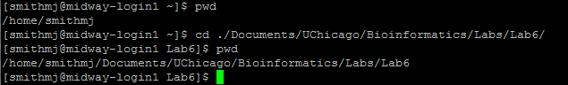
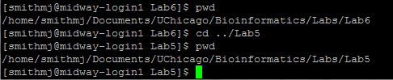
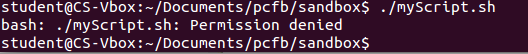
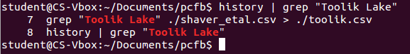

---
***Objectives*** <br>
**0. Finish our work with the Center Star Algorithm <br>**
**1. Learn Basic Unix commands <br>**
      -navigate directories<br>
      -manipulate files<br>
**2. Write and run basic Unix bash scripts<br>**
**3. Login and work on Midway Supercomputer<br>**
      -move files between local computer and Midway<br>
      -submit job scripts<br>
      
<span style="color:red"> For your work in this lab, please add your answers to the file entitled 'Ans7_LastnameFirstname.Rmd' and change the file name to have *your actual* first and last name. The answers are formatted to be in blue and all questions are in green, in both this document and in the answers document. Upload your HTML to Canvas **by 11:59 p.m. the day after your lab day**.\span  

<span style="color:purple"> This lab requires access to a Unix command prompt.  Mac users may access the 'Terminal' application under **Applications > Utilities > Terminal**.  
<br>
Windows 10 users may install a linux subsystem, **[see](https://docs.microsoft.com/en-us/windows/wsl/install-win10)**. Please see below for more details. If you have difficulty installing this program please talk to Dr. Haddadian or your TA.\span  

## Part 0: Putting together the Center Star Algorithm

Feel free to consult Lab 6 as you will need to use functions you wrote / learned to use in that lab for the tasks below.

<span style="color:green"> 0.1 For each alignment against the center sequence, retrieve the list of patterns and the list of subjects. Use this data along with the index of the center sequence to run `buildMSA()` on the sequences in `sequences`. \span  

### Putting it all together


```{r,message=F}
globins <- unlist(seqinr::read.fasta("globins.fasta", seqtype = "AA", as.string = T))
source("pairAlign.R")
library(Biostrings)
```

<span style="color:green"> 0.2 Let's put everything together. Write a function `centerStar()` that takes in **a list of sequences**, the substitution matrix, `gapOpening`, and `gapExtension` to perform pairwise alignment and uses `buildMSA()` to output the multiple sequence alignment (Hint: you need to call `buildMSA()` inside `centerStar`). Test this function on the Globin protein sequences contained in **globins.fasta** that have been loaded into R for you as `globins` as a vector of concatenated uppercase strings. Again, **use "BLOSUM62", gapOpening = -11, and gapExtension = -3.** \span  

To recap what you need for performing Center Star alignment, you need to perform the following steps after you have the sequences and the criteria for performing alignment:
1) Take in the list of sequences and perform pairwise alignment as a handshake problem (you need to use `pairAlign`). Record the alignment results (the patterns and subjects, not the score) into two separate variables. You can either store them as two matrices or two vectors.
2) Calculate the distances among the sequences based on the alignment and obtain the distance matrix or distance vector (Still, there are two approaches)
3) Calculate the total distances for each sequence.
4) Find the center sequence based on the total distance and the sequence length.
5) Extract the `patterns` and `subjects`
6) Perform `buildMSA()` using `patterns`,`subjects`,and `center`.
All these steps need to be included in the `centerStar()` function.


<span style="color:purple"> While sequence alignment developed historically in the context of evolutionary analysis (and was introduced that way in these exercises), many of these algorithms are finding additional uses with modern sequencing technologies. For example, if we sequence an individual's genome and want to see where his or her genome differs from a reference genome, we would conduct pairwise alignments between genomic regions. Similarly, pairwise alignment to a reference genome is used to infer from where reads from assays such as ChIP-Seq or RNA-Seq derived. Furthermore, sequence alignment is used in the initial assembly of genomes from millions of short, overlapping reads. Thus, the algorithms and difficulties in sequence alignment relevant for evolutionary analysis have deep implications for many different fields of biology. \span 

## Part 1: Command-line operations in Unix

In this section we will learn the basics of **command-line** operations in **Unix**, with a focus on learning how to connect to and interact with remote computer systems. First, we will learn the command-line equivalents of many of the basic file management actions you routinely perform on your own computer. Next, we will learn how to connect to the Midway high performance computing cluster and perform analyses. <span style="color:purple"> **The details of this section will be important for upcoming labs as well as your final projects, so be sure to ask questions about anything that is unclear**. \span

### Programs for Windows Users
Instead of connecting to Midway through the ssh command in Terminal, Windows users have several options to run a Unix command prompt:

(1) Windows 10 Users can install the application 'Windows Powershell'. Once you open this app, you have a command line where you can run Unix commands.

(2) Other Windows Users, including Windows 10 users that have not updated their system in a while, can install 'Cygwin', making sure to select 'ssh' during installation.  The root directory of 'Cygwin' is located in Program Files, and you can change the start-up working directory in your 'Cygwin' settings.

(3) Install a linux sub-system like 'Ubuntu' through the Microsoft store.

(4) You can use the Mac computers in the lab.


### A bit of explanation
An **operating system** (OS) contains the suite of software that forms the base of a computer machine. For example, the Windows OS refers to a set of programs that tells your computer how to display features and accept commands to perform various computations. This includes the display of the graphical user interface (GUI) that we are all familiar with, allowing for point-and-click navigation and computation. At their core, most modern OS's (apart from Windows) are based on the **Unix OS**. In this lab we are going to move one step closer to the Unix OS from our familiar GUI perch. We will interface with Unix through the *shell*, which refers to a program that supplies a command-line interpreter for the user to direct commands to the computer core. The particular shell we will use is the bash shell (standing for **B**ourne-**a**gain **sh**ell), which is the Unix shell you are most likely to encounter in bioinformatics applications.  

<span style="color:purple"> Working from the command line is powerful. It allows for the automation of repeated sequences of operations; for example - moving, combining, or extracting data. <span style="color:black"> Many of us have wasted substantial time repeating the same series of point-and-click operations from our computer GUI. The command line gives us the ability to automate this task. Although it takes some upfront investment, this automation is fruitful in the long run, particularly when it encodes a data handling tactic we plan to use many times in the future. \span

<span style="color:purple"> Working from the command line is also flexible. <span style="color:black"> None of us likely has the computational skill to write a new program that operates in the confines of our Windows or Mac OS GUI. However, it is not difficult to write a program that operates a level deeper at the command line to do things we would otherwise be unable to code. \span  

<span style="color:purple"> Finally, working from the command line is the only way to access remote clusters of high-performance computers. <span style="color:black"> Given the large amount of data in modern biological analyses, external computing resources are becoming a necessity. For the most part, it is impossible to control analyses on external computers through a GUI. Through the command line, however, we can login to that computer and perform computations as if we were standing in front of that very same computer. This gives us the power to interact directly with much more powerful computing hardware, from the comfort of wherever our desktop or laptop currently lays. However, working from the command line comes with certain risks. Your computer will do whatever you tell it to do from a command. As such, it is possible to permanently delete files or whole chunks of your hard drive with an errant punctuation mark or character. It is thus important to take care in constructing commands and documenting past actions to avoid making a mistake to which 'ctrl-Z' has no power to fix. \span  

On your personal Mac find and open the 'Terminal', or open your linux subsystem if you are on Windows. A small window opens, and after a brief login, presents you with a command prompt. The Terminal command prompt operates similar to the command prompt we have seen in R. The user types a command in the language interpreted by the command prompt and an action is performed. **Remember that you can use the up and down arrows to catch your previous commands.**


We are now going to explorer how to navigate the file system of your computer from the command line. Knowledge about how the file system is arranged is essential for using a computer at the command line. We all have an intuition as to how file systems are arranged from our experience working with 'Folders' of files on our traditional computer OS. The trick now is to learn the commands that correspond to the double clicks and 'New Folder' buttons we would use in something like the Mac Finder, as these GUI features are not available to us when working on a remote device.  

There are two directories of special importance for moving through the file system of your computer: your **home directory**, and your **root directory**. <span style="color:purple"> The root directory is the most inclusive folder on the system <span style="color:black">, which contains all other files and folders. If you were clicking the 'back arrow' on a GUI folder, the root directory is as far back as you can go. <span style="color:purple"> The home directory is where you are initially logged onto when you open a new Terminal window. We can figure out the absolute path to our current location, the home directory, with a simple command: *pwd* (present working directory). <span style="color:black"> The **pwd** command should be used liberally when working at the command line to ensure you are always in the proper location to access and deposit files of interest.

<span style="color:green"> 1.1 What is the path to your "Desktop" directory (Hint: navigate to your "Desktop" folder using the "cd" (change directory) command and then type "pwd" in your terminal window)? \span


<span style="color:red"> Note to Windows Users using Linux subsystem.  To access directories in your computer C://, the path directory is **"/mnt/c"**.  For example, "My Documents" which is located at "C://Users/Ethan/Documents" has the linux path "/mnt/c/Users/Ethan/Documents". \span

The *pwd* command returns the **absolute path** to your current directory.<span style="color:purple"> An absolute path originates from the root directory in describing <span style="color:black"> the location of a directory or file. As we saw above, the absolute path starts with a '/'. This isolated '/' with no preceding characters signifies the root directory. To get to your *home* directory from the *root* directory, we follow the pathway of sub directories indicated in the absolute path. If this is unclear, open the Finder and convince yourself how this absolute path tracks with your normal conception of folder structures.  

In contrast to an absolute path, <span style="color:purple"> a **relative path** specifies the location of a directory or file relative to your current location (the working directory). <span style="color:black"> For example, the absolute 
path to my home directory is '/Users/smithmj'. Within smithmj, I have a folder 'scripts' containing a shell script 'HideFiles.sh'. The absolute path to 'HideFiles.sh' would be '/Users/smithmj/scripts/2/HideFiles.sh'. However, given my current directory is smithmj, the relative path would be './scripts/funstuff2/HideFiles.sh'. <span style="color:purple"> Notice the period placed prior to the first forward slash. This period represents the current directory. If this period were not present, the computer would try to look for a 'scripts' file in the root directory, as an initial forward slash tells the computer to reorient to the root directory. \span  

<span style="color:green"> 1.2 What would be the relative path to HideFiles.sh be if our present working directory was the 'Downloads' directory? What would the relative path to HideFiles.sh be if we were currently in the 'funstuff2' folder? \span  


On my computer, the files for BIOS10602 are nested deep within my file system. The absolute path to the Lab6 contents on my computer is:   */Users/smithmj/Documents/UChicago/Bioinformatics/Labs/Lab6*  

If I were performing manipulations or analyses on files in this folder from my home directory, it would be a pain to repeatedly type this entire path at the command prompt for every file I access or create. Instead, it would be useful to move my present working directory to the 'Lab6' folder.<span style="color:purple"> This is accomplished with the ***cd*** (**c**hange **d**irectory) command: \span  



The *cd* command can take you to whatever absolute path or relative path you specify. If you don't supply the *cd* command with a path (i.e. you just type and execute 'cd'), the default option is to bring you back to your home directory. This can be useful if you 'get lost' in your navigation and just want to start over.  

My 'Labs' folder also has a 'Lab5' sub directory. A quick way to navigate to Lab5 from the Lab6 folder is as follows:  



<span style="color:green"> 1.3 What are the two periods '..' referencing? (Hint: if one '.' points back to your current directory then then two '..' would point back to where?) \span  


<span style="color:green"> 1.4 Navigate to your home directory. Now construct a command with 'cd' that takes you to your root directory from your home directory. Paste your command into your lab answer sheet document. \span  


One tip that will save you eons of time is **tab completion**. When you are referencing a file or directory, you can begin to type its name and hit the <tab> key to complete the name, assuming the letters you have typed so far are unique to a particular file or directory. To explore this behavior, navigate to your home directory. Type 'cd Desk<tab>', and notice how the tab completes the name of the 'Desktop' sub directory. Return to your home directory. **Now type 'cd D<tab>'. Notice that nothing happened?** This is because two or more directories in your home directory begin with a 'D'. However, if you enter <tab> a second time, the Terminal will echo back to you all of the available options that start with 'D.' This might include 'Desktop,' 'Documents,' and 'Downloads.' If you complete enough letters for any directory such that it is unique, then press <tab>, Terminal will complete the path.  

<span style="color:purple"> The third command useful for directory navigation is *ls* (list). <span style="color:black"> This command lists the contents of the current working directory. If an absolute or relative path is provided, ls will list the contents of the given directory. From your home directory, test out the ls command with the following prompts: \span  

*ls*  
*ls /*  
*ls ./Desktop*  

Similar to in R, basic bash functions come with documentation (again, bash is what we use to talk to the OS). Explore the documentation of the ls command with *man* (for **man**dual):  
*man ls*  
	
This brings up the manual for the *ls* command. You can scroll up and down with the arrows, scroll by page with 'z' and 'w,' and exit the manual page by typing 'q'. 

<span style="color:green"> 1.5 Using the manual and simply testing commands in your home directory, explain what happens with the following commands, in which additional **options** are passed to *ls* with the '-' character. Note, something like 'ls -ls' is equivalent to 'ls -l -S". (If you are using Windows Powershell and these commands aren't working, ask your TA for help!) \span  

<span style="color:green"> *ls -l*  (that is the letter L, not the number 1) \span  


<span style="color:green"> *ls -i*  \span  

<span style="color:green"> *ls -m*  \span  

<span style="color:green"> *ls -lS*  \span 

<span style="color:green"> *ls -lrth*  \span

Let's introduce the **wildcard** character. In most commands that take a path as an argument, we can use the wildcard character ' * ' to increase the breadth of our search. From our home directory, we can try 'ls * '. This is the broadest wildcard, and will apply the ls command to list the contents of **all sub directories in our working directory**. When you type a command like 'ls a* ' , the shell finds all the contents in the current directory starting with letter **a** and passes them to the ls command

<span style="color:green"> 1.6 What happens when you try 'ls Da*' from your home directory? Explain your answer. \span 

Now that we've learned how to navigate directories, let's learn the commands for handling files from the command prompt. For these exercises and the homework, please use the file 'pcfb_examples.zip'. This zip file contains the files necessary for examples provided in the book 'Practical Computing for Biologists' by [Haddock and Dunn](https://practicalcomputing.org). **The appendix of this book is available in the lab folder, which contains a reference sheet of most of the common bash commands you will encounter.** I encourage you to download this and consult it when conducting the following exercises.  Save the zip file to your Documents folder. In the Terminal, navigate to your Documents, and execute 'unzip pcfb_examples.zip'. This will unpack the zip file and create several sub directories.

<span style="color:green"> 1.7 What are the sub directories that are in the newly created 'pcfb' folder? Which is the largest size file in the 'examples' sub directory? (Hint: if you are unsure about how to check the file size, refer to the commands in Q1.5)\span

Let's explore how to add and remove new directories. Change directories to the 'sandbox' directory of 'pcfb'. Notice that it is currently empty (use *ls*). Execute 'mkdir myDirectory', and notice the addition of a new folder within 'sandbox' (*ls -lF*). Now execute 'rmdir myDirectory' and notice the disappearance of your directory. By default, rmdir is conservative and will only allow you to delete a directory that has no file contents. <span style="color:purple"> However, with *rmdir* (and the equivalent *rm* for files) be careful because these commands are not like moving a file to the 'Trash' where it could be recovered later. \span  

To give us a file to investigate, let's copy the file 'structure_1sl8.pdb' from the 'examples' folder to 'sandbox'.<span style="color:purple"> The command for copying files is 'cp', which takes two arguments: the relative or absolute path to a file of interest to be copied, and the relative or absolute path of the directory to where the file should be copied. <span style="color:black"> For us, this second argument would be something like './' since we are currently in the 'sandbox' directory. We can also rename the copied file at this step if we want (for example, if we were copying a file into the same directory as the original), by specifying a file name in the second argument './newfilename.txt'. <span style="color:purple"> A similar command to *cp* is 'mv' (move). <span style="color:black"> This command follows the same structure as *cp*, but instead of placing a duplicated file into the new location, it moves the file (and potentially renames it). \span  

<span style="color:green"> 1.8 Construct a command to **copy** the file structure_1sl8.pdb from examples to pcfb. Then construct a command to **move** the newly duplicated file from pcfb to the sandbox folder. Paste both commands in your answers file. \span  


There are several ways to look at or edit the contents of a text file from the shell. First, let's explore the program *less*. We can investigate our PDB file by executing 'less structure_1sl8.pdb'.  

Navigation through a *less* page is similar to *man*. The structure of a PDB file contains various annotations and descriptions at the beginning of the file. The last part of the file lists all of the atoms of the protein and their three-dimensional coordinates; this is the portion that is read by a program to construct a three-dimensional model of the molecule.

<span style="color:green"> 1.9 What protein is represented in this PDB file, and from what organism? How many atoms are present in the protein structure? \span  

The program *less* only allows us to read the contents of a file, but we cannot make changes. There are several programs for file manipulation at the command line; we will use the text editor *vim* for this purpose. We could edit the PDB file above by executing 'vim structure_1sl8.pdb'. You can use your up-down arrow keys to navigate through the file, press i to get into "insert mode" and change the contents of your file, and press escape to go back into "visual mode". When you are done editing a file, go into visual mode, and type ":wq", where w stands for "write" and q stands for "quit", and press enter. The equivalent command is ":x". If you have made edits to a file, but you don't want to save those changes before you quit, you can type ":q!". To learn more about vim commands, visit: https://vim.rtorr.com/.

The *vim* program can also be used to <span style="color:purple"> create a new text file <span style="color:black"> by supplying a new filename as the argument to **vim**. Execute: 'vim myScript.sh'. Here, we are creating a new text file with a '.sh' extension, indicating that we are going to turn it into an **executable bash script**.  

In the new *vim* window, type the following two lines of code to define our script:  
#! /bin/bash  
echo 'Hello, world'  

This first line contains a symbol called a **shebang**. The shebang tells the command line interpreter to execute subsequent lines of code in bash shell. In this case, we follow the shebang with the absolute path to our *bash* program, telling the command line to execute the lines in bash. The rest of the code defines what our script will do. Save and exit the vim window.
If we try to run this script, we get the following error:



<span style="color:purple"> In order to execute the contents of a file from the Terminal, this file must have the proper **permissions** to be executed. <span style="color:black"> The current permissions of a file are listed in the extended output of the 'ls -l' command we used before. The first column of this output indicates the various permissions a file can take. We are interested in the 2nd, 3rd, and 4th of the ten characters of this shorthand. These characters indicate whether the file is allowed to be read (**r**), written to (**w**), or executed by (**x**) the current user (you). If one of these symbols is replaced by a dash, it means this permission is not granted.

<span style="color:green"> 1.10 What permissions are initially present on myScript.sh? \span  


In order to give the current user (**u**) permission to execute (**x**) myScript.sh, execute the *chmod* (**ch**ange **mod**e) command: 'chmod u+x myScript.sh'. The u+x nomenclature says to add the x permission to the user. We could construct other *chmod* commands to remove permissions ('u-x'), or change permissions for various other groups of users who might encounter our script. If you are writing a bash script that you expect other people will also be using, chmod +x myScript.sh also makes sense, since you would not be specifying certain users with executive privilege. **If we check the file again with *ls -l*, we can see that this file is now executable, and can be run as follows:**  


<br>

The last command we will learn for now is *rm* (**r**e**m**ove). This command is used to permanently delete a file from your computer. Its usage is simple: 'rm myScript.sh'. **As mentioned before, be careful in its use, as files deleted with *rm* cannot easily be recovered!**

## Part 2: Working on Midway

For this part you will need to be logged in to Midway. Once you login into Midway, it is as if you are now sitting at a keyboard directly in front of the Midway computer cluster. As we saw with our own computer, we are initially logged into our home directory on Midway.

To log into Midway 2, enter **'ssh cnet@midway2.rcc.uchicago.edu'** into your command prompt, replacing 'cnet' with your **actualy CNetID**.  For example, the command the professor would use to log into Midway 2 is **'ssh haddadian@midway2.rcc.uchicago.edu'**.  You will be asked to enter a password, which is your CNet password. Do so now.

<span style="color:green"> 2.1 In your Midway home directory, create a new sub directory entitled 'Lab7' using the mkdir command. Navigate to this new folder, and determine its absolute path. Paste these commands below for this lab. \span  

<span style="color:purple"> Our new Lab7 folder is currently empty; however, we want to upload three files to this directory: Lab7source.R, ORF1-1.cpp, and job-submit.sh, available in the folder called Upload within the archive of Lab 7 files. \span To upload these files to Midway, **open up a new Terminal window or tab, which opens a new shell for your local computer.** We are going to transfer these files to Midway using the *scp* command (**s**ecure **c**o**p**y), which is used to both upload files to a remote computer and to download results. The scp command has the same usage as *cp*. The only difference is that one of the file paths refers to a file or directory on your local computer where you are executing the *scp* command, while the other references the absolute path to where the file is being deposited or downloaded from the remote computer. In order to upload all three files to Midway simultaneously, I would execute the following, and enter my password when prompted:  

*scp /Users/haddadian/Desktop/BIOS10602/Lab-7/Upload/ haddadian@midway2.rcc.uchicago.edu:~/Lab7*

<span style="color:purple">There format of of this line of code is 'scp host_directory/files destination_directory', notice that there are spaces in this line of code that separate the command from the two input arguments \span

**Windows users can install and use the program WinSCP to upload and download any files to/from Midway .**

There is another command similar to `scp` called `rsync`. If you call `rysnc -avzPh source_dir dest_dir`, the shell will provide the details of file transmission as well (e.g. the progress of transmission and the size of the file transmitted). For this lab, you can work with `scp` but feel free to explore the alternatives.

<span style="color:red"> Caveat for scp and rsync: No matter which direction you are sending (either from remote to local or from local to remote), you need to execute the command on your **local** terminal!\span

<span style="color:green"> 2.2 Use *scp* commands (either per file or one command with a wildcard) to upload the three files to your Lab7 directory on Midway, and paste these commands in your lab document. Return to your secure shell tab, and observe that three files are now present in the Lab7 directory. For Windows users, you can use [WinSCP](https://winscp.net/eng/index.php) to transfer the files, but you still need to provide the commands that you'll theoretically use. \span  

Lab7source.R and ORF1-1.cpp contain an ORF finder algorithm written in a hybrid of R and C++, which allows us to conduct ORF analyses several orders of magnitude faster than our loop-based algorithms written in R. This is important because today we will look to find all the possible open reading frames in Chromosome 3 of the human genome, which spans nearly two hundred million bases. If we were to attempt this computation on our personal machines using the suggested implementation from our previous lab, then it would take on the order of several hours to complete. \span

<span style="color:green"> 2.3 Instead of printing out the completed list of ORFs in R (which we would not be able to see easily from the command line), this script generates two .csv tables for ORFs in both the forward and reverse directions. What function in the Lab7source.R file is used to generate these outputs? (Hint: you can always check the content of a file by using `less filename` command in your terminal.)\span

The other file we uploaded is a job-submit script. Instead of simply executing a command on the **node** to which we have logged in (the **login node**), we instead use a job submission script to direct our computational analysis to one of several **compute nodes** on the computer cluster.

<span style="color:green"> 2.4 Briefly explain why you would log into dedicated login nodes and submit jobs to dedicated compute nodes, instead of doing both on the same node. (If you can't think of a reason, execute the command 'squeue' — This will show you the current queue (line of jobs) running or waiting to be executed on the compute nodes.) \span  

Every user or group on Midway has a certain allocation of computer resources available for use. This is measured in **node hours**, the number of hours of computation that are used up by submitting jobs to compute nodes.  

We now need to open the job submission script and change some values.<span style="color:purple"> When you submit each job to the compute nodes, you will need to use a job submit script that tells the compute node scheduler how many nodes (processors you want), how much time your job will take to execute, the name of your job, and the actual commands to execute.<span style="color:black"> Open up the job submit script in the terminal with nano or vim (ie: 'nano filename.sh') `nano` is easier to get hands. To copy test from the nano editor, you can use `ctrl/command+shift+C` to copy the text and then `ctrl/command + V` to paste the texts into your answer sheet. A more detailed explanation of copying and pasting in nano is [here](https://linuxhandbook.com/cut-copy-paste-nano/). Feel free to search for another tutorials on using nano and vim.

<span style="color:green"> 2.5 Change the following components of the job submit script: (To answer these questions, you need to paste the script.)  \span  
<span style="color:green"> a) The job name is set to "test", which is not terribly descriptive. Choose a better name for this job and change the `job-name` parameter accordingly. \span

<span style="color:green"> b) The submit script currently requests one second of compute time. This is not quite enough time to complete the job. Change the `time` parameter to request **one hour** of compute time.  \span    <br>

<span style="color:green"> c) The account parameter is currently blank. Enter our class account `bios10602` so the scheduler knows which account to pull the resource allocation from. *Copy and paste your code into your answer file. *\span

<span style="color:green"> 2.6 What bash command is executed to run the Lab7source.R script? \span  

<span style="color:purple">We need to do one final step to copy the sequence data from the class directory to our personal Lab7 directories. </span> Assuming that you uploaded the lab files to your Lab7 directory, execute the following command:

```
cp /project2/bios10602/Lab7/Homo_sapiens_Chr6.fasta ~/Lab7/Homo_sapiens_Chr6.fasta
```

With these parts done, we can now submit the job for Midway to run. \span  

To send our job to the compute nodes, we use the **sbatch** command. Its syntax is 'sbatch jobsubmitname' (swapping out jobsubmitname for your own job submission script name). 

Execute this command now on your job submission script to submit your first supercomputer computation! If everything goes well, your job should start running. You can check the status of your job by entering 'squeue -u YourCNET'; you should see something like the following:
<br>


<br>

The 'R' in the 'ST' column means that the job is currently running. Other options that you might see are 'PD' (queued) or 'C' (completed). If you see a 'C' in less than a minute, notify your TA; it probably means that something went wrong. 

After several minutes, your job should have produced 3 files: "human_Chr3_ORFs_forward.csv", "human_Chr3_ORFs_reverse.csv" , and "slurm-14032785.out" (The name of the `out` file depends on how you name the output file in the sbatch script). The first two files contain the results of our ORF analysis. The last one (if you use 'less' to view it), lets us know whether or not our script ran correctly.  **For the homework** we need to copy this data from Midway to our own laptops to perform some basic analysis. <span style="color:red"> **For Mac users, this will involve the same *scp* command we used above. Windows users can install and use the program WinSCP to access Midway and to download any files.** </span>

## Part 3: More commands in Unix

Download and unzip the file `pcfb.zip` to your computer as you did before. One useful program for file handling in the shell is `cat` (con**cat**enate), which takes a list of files as an argument, and combines them all together.

<span style="color:green"> 3.1 Navigate to the sandbox directory. Execute and compare what happens with the following two commands. What is each of the two commands doing? How are they different? What is the `>` symbol doing?  \span  

<span style="color:green"> `cat ../examples/*.seq` \span  


<span style="color:green"> `cat ../examples/*.seq > ./chaetognath.fasta` \span  


Remember back to Lab 2 when we used the `grep()` command in R to search a table for a keyword. There is an equivalent command `grep` that can be used from the Unix command line to search a file and return any lines that match the search query. For example, if I wanted to print out the lines containing headers from the above `chaetognath.fasta file`, I could execute: `grep “>” chaetognath.fasta`. Different from the `grep()` function in R, the `grep` command here will directly print out the row that contains the pattern. Also, you need necessarily need the specify the column for this command. 


<br>

<span style="color:green"> 3.2 The file `examples/shaver_etal.csv` contains various measurements in a comma-delimited text file. These measurements were obtained from various field sites, including one called “Toolik Lake”. Construct a command with grep that extracts all data entries from “Toolik Lake” and saves the output in a file called `toolik.csv`. Paste the command below. \span 

Another powerful feature of the command line is the pipe character `|`. This character redirects the output of a particular command to the input for the subsequent command. It thus can save potentially burdensome steps of saving intermediate search results to a separate file.  

As an example of its use, let’s say I wanted to find a previously executed command that involved the words “Toolik”. I could execute the `history` command and scan through the all of the previously executed commands. However, this could be a big pain to search through. Instead, I can use the piping character to redirect this output to the grep command, and print out all commands I have executed recently with the word “Toolik”:  



<br>
If you want to search a data file based of two different search terms, you could perform one grep search and save the result to an intermediate file, and then search this file with the second grep command. Alternatively, we could perform the first grep search, and pipe the output to the second grep search.  

<span style="color:green"> 3.3 Construct a piping command that first searches `shaver_etal.csv` for all observations from July (use the “Jul” search query), and then pipes these results to a second `grep` search for “Toolik Lake”. Save the results as a file `toolik_Jul.csv`. Paste the command into your report. \span  


## Lab Homework

<span style="color:red"> The homework is due by 11:59 PM on the Monday following your lab. Provide your answers in an Rmd file with the contents of this homework. Call the Rmd file "HW_7_LastnameFirstname.Rmd" and submit it on Canvas for your T.A. to grade.  \span

### Working with results from Midway

<span style="color:red">For this part of the exercise, you will need access to a Unix command prompt or SCP client and an internet connection.

<span style="color:green">1. Use `scp` to retrieve Homo_sapiens_Chr3_ORFs_forward.csv and Homo_sapiens_Chr3_ORFs_reverse.csv from Midway. Provide the command you used below. </span>

<span style="color:green">2. Load the tables into R using `read.csv()` and examine the structure of the data by printing out the first few lines with `head()`.</span>

```{r}
#Your code here
```

<span style="color:green">3. How many ORFs with a length of at least 150 amino acid residues were detected in the forward and reverse directions of Chromosome 3 of the Homo sapiens genome? (Hint: the Length column is in nucleotides)</span>

<span style="color:green">4. Chromosome 3 of the Homo sapiens reference genome is currently known to contain about 1000 genes that code for about 4000 proteins. 
<br>
a) Why might the number of ORFs you obtained and genes be different? Propose two possible reasons for any discrepancy. 
<br>
b) How can more than one protein be encoded by any given gene? </span>
